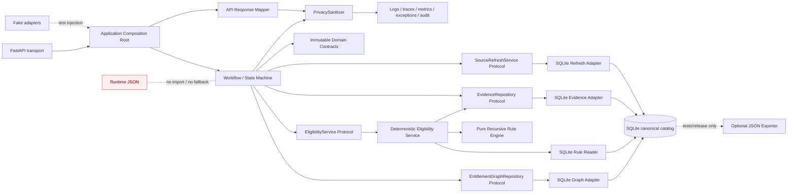
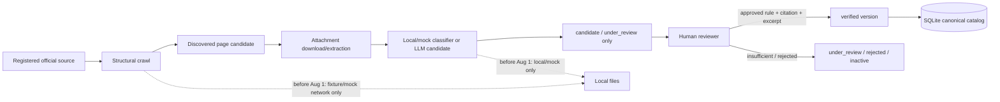

# 技術設計文件：資料層與規則引擎補齊

## Overview

本設計以 finalized `requirements.md` 為唯一功能依據。**本機 SQLite 是目前資料策展與 runtime 查詢的單一真相來源**，直到另有 owner-approved storage migration ADR 與替代 adapter。FastAPI 啟動時由唯一的 application composition root 建立 SQLite adapters，再以 storage-neutral Python Protocol 注入 Workflow 與 state machine。Workflow 不知道 SQL、資料表、`sqlite3.Connection`、`sqlite3.Row` 或 `program_id` 等儲存細節。

Runtime 不讀 JSON，也沒有 JSON fallback。JSON exporter 只是一個可選的 tests/release 工具：它從 SQLite 單向、deterministic、atomic 地產生 snapshot，不能被 runtime 匯入或回寫 SQLite。

### 設計目標

1. 以 typed Entitlement Graph 展開人生事件、方案、機關與文件關係，保留尚缺資訊但仍可能成立的 path。
2. 以 versioned `all_of`／`any_of` Rule DSL 作為唯一 canonical 規則，Rule Engine 只執行人工核准版本。
3. 以 immutable domain contracts 隔離資料庫、Workflow 與 API；`relevance_score` 只在 backend 排序，永不出現在 API。
4. 對 `candidate`、`under_review`、`stale`、`rejected`、`inactive` 採保守且一致的狀態閘門。
5. 每個完整資格結論都能追到已登記的官方來源與人工核准 citation；缺證據時降級，不猜測。
6. 先用 request 開始時已 commit 的目前資料回應，再非阻塞排入同日去重的本機 refresh job。
7. 集中處理隱私：raw user text 僅存於單次萃取 scope；observability 在 serialization 前遞迴清除敏感值，失敗時 fail closed。
8. 保留 structural crawl、附件、LLM candidate、人工審查的後續設計；live network／AWS／LLM 路徑須經 owner 核准、使用 Git 外部 credentials、保留 local test path 並同步 migration guide，且永遠不能自動驗證資料。

**需求追蹤：** 需求 1–16。

### 不在本設計中決定的事項

- 不在本設計中選定 production AWS database、queue、object storage、deployment 或 observability 服務；任何 live AWS 路徑需另經 owner 核准並更新 migration guide。
- 不把 credentials、tokens、`.env` 或 account-specific secrets 寫入 repository，也不讓 local tests 依賴 live AWS。
- 不新增、推定或示範任何真實福利門檻、期限、金額、法規原文或來源摘錄。
- 不讓 LLM、crawler、importer、converter 或 exporter 決定資格或把資料標成 `verified`。
- 不把「已爬取」解讀成「法律內容完整」、「網站完整」、「零遺漏」或「所有福利均已索引」。

**需求追蹤：** 需求 10.7–10.8、12.7–12.8、15.2–15.3、16.1–16.14。

### Repository research 摘要

本設計只研究 repository 內的 finalized requirements 與現有 backend；沒有查詢外部網站，避免引入未核准的福利事實或雲端選型。

- [`backend/app/orchestration/state.py`](../../../backend/app/orchestration/state.py) 已有 frozen Pydantic workflow models、`item_id`、四種 eligibility status、結構化金額與 citation 雛形；但目前的 `CandidateItem` 同時承擔 workflow state 與 catalog contract，需透過 mapper 漸進解耦。
- [`backend/app/schemas/session.py`](../../../backend/app/schemas/session.py) 目前把 `publisher_name` 暴露為 `publisherName`，且只有簡化的 `decisiveConditions`；新 API mapper 採 additive compatibility，加入完整 structured reasons 與日期欄位，但不暴露 `relevance_score`。
- [`backend/app/rules/engine.py`](../../../backend/app/rules/engine.py) 目前直接讀 `program_rule_fields`、接受 connection、回文字 reasons 與單一 amount。新 engine 必須改讀 canonical Rule DSL domain model，且不得接觸 connection 或 table name。
- [`backend/app/services/benefit_catalog.py`](../../../backend/app/services/benefit_catalog.py) 已有來源、文件、方案與證據的 SQLite 基礎，但 `program_rule_fields` 仍可寫；migration 會先保存 legacy 資料，再由人工確認轉入 canonical Rule DSL，最後以唯讀 projection 取代原表。
- [`backend/app/main.py`](../../../backend/app/main.py) 已是 FastAPI factory，但目前只組裝 session store；本設計將它保持為 transport 入口，實際 dependency construction 放到單一 composition module。
- [`backend/app/observability/logging.py`](../../../backend/app/observability/logging.py) 已有 allowlist 與不記 exception message 的保護；仍需在所有 log、trace、metric、exception、audit serialization 前加入共同 PrivacySanitizer，並在 sanitizer 不確定時取消原 payload emission。
- `backend/pyproject.toml` 目前沒有 PBT library。本設計選擇 Hypothesis 作為未來 property tests 的工具，但不在此文件任務中修改 dependency，也不假稱它已安裝；實作時須經 owner 核准後以精確版本加入。

這些研究結果直接形成下方的 mapper、migration、composition root、privacy 與測試設計。

**需求追蹤：** 需求 2、3、5、6、9、13–16。

### 關鍵決策

| 決策 | 採用方案 | 初學者說明 | 需求追蹤 |
| --- | --- | --- | --- |
| Runtime truth | SQLite last successful committed state | 使用者查到的是最近成功提交的完整版本，不看半寫入資料，也不改讀 JSON | 1.1–1.9 |
| 跨層邊界 | Immutable contracts + Python Protocol | Workflow 只知道「可以問什麼」，不知道資料放在哪張表 | 2.1–2.12、3.1–3.15 |
| Canonical rules | Versioned recursive Rule DSL | 規則只有一份；相容表由工具產生，不能人工雙寫 | 5.1–6.10 |
| `stale` | 可見但一律 `needs_human_review` | 過期資料可提醒使用者可能相關，但不能產生完整資格結論 | 7.4–7.5 |
| Relevance | Backend-only sort metadata | 分數只決定順序，不代表資格機率，也不傳給前端 | 8.1–8.11 |
| Refresh | Current-data-first + local background enqueue | 先回答，再排更新；不讓 crawl 或 LLM 卡住請求 | 11.1–11.10 |
| Coverage | Measurable progress and gaps | 只報這次 scope 中爬了多少、錯了多少，不保證沒有漏 | 12.1–12.13 |
| SQLite lifecycle | `contextlib.closing` 或明確 `finally: close()` | `with connection` 只處理 transaction，不保證關閉，所以每條路徑都要明確 close | 13.1–13.11 |
| JSON | Optional tests/release export only | JSON 是輸出報表，不是系統執行時的資料來源 | 14.1–14.11 |

## Architecture

### Component diagram



### Request data flow

```mermaid
sequenceDiagram
    participant U as Requesting User
    participant API as FastAPI
    participant WF as Workflow
    participant G as Graph Repository
    participant E as Eligibility Service
    participant C as Evidence Repository
    participant R as Refresh Service
    participant DB as SQLite

    U->>API: sanitized request + ephemeral raw text
    API->>WF: request-scoped input
    WF->>WF: extract allowlisted attributes; finally dispose raw text
    WF->>G: expand_from_event(event_id, attributes)
    G->>DB: read transaction at request-start committed snapshot
    DB-->>G: rows
    G-->>WF: CandidateItem tuple
    WF->>E: evaluate_many(item_ids, attributes)
    E->>DB: load statuses + one approved current Rule DSL
    E->>C: resolve citations for evaluated source references
    C->>DB: read approved evidence
    E-->>WF: EligibilityDecision tuple
    WF->>R: get_coverage_status(scope)
    R->>DB: read coverage snapshot
    R-->>WF: CoverageSnapshot
    WF->>R: request_on_demand_refresh(request)
    R->>DB: atomic INSERT ... ON CONFLICT dedup
    R-->>WF: RefreshReceipt（不等待 worker）
    WF-->>API: domain result
    API->>API: owner-aware mapping; omit relevance_score
    API-->>U: current committed response
```

讀取採短生命週期一致性 read transaction。組好目前資料的 response 後，refresh enqueue 才使用另一條短 transaction；背景 job 失敗不會改變已組好的 response，也不能 rollback 先前已成功的 catalog commit。

### Curation and review flow



Structural crawl 仍從已登記來源的結構出發、遵守 robots policy，附件仍保留檔案 metadata 與 extraction status，LLM 仍只做分類與結構化候選。這些都是 later-phase curation work；啟用 live network、live LLM 或 live AWS 前須取得 owner 核准、保留 local fixtures/mocks，並在同一批次更新 `docs/aws_migration_guide.md`。

### Ownership boundaries

| Owner | 負責 | 明確不負責 |
| --- | --- | --- |
| Domain contract layer | 跨模組 immutable shapes、enum、validation | SQL、API camelCase、workflow transitions |
| SQLite adapters | SQL、row mapping、transaction、connection closure | 提問順序、自然語言、資格政策硬編碼 |
| Entitlement Graph repository | path expansion、relations、stable ordering | Rule DSL eligibility evaluation |
| Eligibility service | status gate、required fields、Rule Engine orchestration、citation completeness | crawl、LLM、API wording |
| Pure Rule Engine | 遞迴 evaluate 已核准 DSL | DB、status transition、source retrieval |
| Workflow/state machine | session、提問、停止、轉介、呼叫四個 ports | SQL、table names、資格門檻 |
| API mapper | requesting-user authorization projection、camelCase、score omission | eligibility decision |
| PrivacySanitizer | 所有 observability payload 的遞迴 sanitization | 改變 domain result |
| Curation pipeline | page/attachment/candidate 與人工審查工作流 | 自動 verify 或 eligibility status |
| JSON exporter | tests/release deterministic snapshot | runtime read、fallback、SQLite import |

**需求追蹤：** 需求 1–2、7–14、16。

## Components and Interfaces

### 1. Implementation modules

下列路徑是 implementation ownership 設計；它不要求 Workflow 知道 DB 名稱。

```text
backend/app/
├── orchestration/
│   ├── data_contracts.py         # canonical immutable shared contracts and enums
│   ├── protocols.py              # canonical storage-neutral Protocol interfaces
│   └── rule_adapter.py           # contracts → existing workflow state mapping
├── application/
│   ├── composition.py            # only dependency construction point
│   ├── eligibility_service.py    # status gates + engine/evidence orchestration
│   ├── candidate_sorting.py      # backend-only total ordering
│   └── mappers.py                # additional application mappings only
├── adapters/sqlite/
│   ├── connection.py             # closing/transaction helpers
│   ├── migrations.py             # ordered migration runner
│   ├── mapping.py                # rows/encoded values → contracts
│   ├── graph_repository.py
│   ├── rule_repository.py
│   ├── evidence_repository.py
│   └── source_refresh_service.py
├── rules/
│   ├── dsl.py                    # recursive domain tree + validation
│   ├── evaluator.py              # pure deterministic evaluator
│   └── compatibility.py          # lossless projection converter
├── privacy/
│   └── sanitizer.py              # recursive, fail-closed sanitizer
├── api/
│   └── response_mapper.py        # requesting-user projection
├── curation/
│   ├── structural_crawler.py
│   ├── attachments.py
│   ├── candidate_extractor.py
│   └── review_service.py
└── testing/
    └── fakes.py                  # no-SQL fake implementations of canonical ports
scripts/
├── migrate_catalog.py
├── validate_catalog.py
└── export_catalog_json.py        # tests/release only
```

`backend/app/orchestration/data_contracts.py` 與 `backend/app/orchestration/protocols.py` 是唯一 shared contract／port 定義；data layer 不再建立 `app/domain/contracts.py` 或 `app/application/ports.py` 第二套介面。`app/main.py` 只呼叫 `build_application_dependencies()` 並將結果掛到 `app.state` 或 FastAPI dependencies；route 不自行 new adapter。上述兩個 canonical orchestration modules 不得 import `sqlite3` 或 `app.adapters.sqlite`。

**需求追蹤：** 需求 2.5–2.10、5.13、13、14、16。

### 2. Immutable domain contracts

使用 Python 標準庫 `@dataclass(frozen=True, slots=True)` 與 tuple。`frozen=True` 防止欄位重新指派；tuple／`frozenset` 防止 collection 內容變更。`expected`、`actual` 若為 collection，constructor 先遞迴 freeze 成 tuple of key/value pairs，不能留下 mutable `dict`／`list` reference。

```python
from dataclasses import dataclass
from datetime import datetime
from decimal import Decimal
from typing import Literal, TypeAlias

ProgramStatus: TypeAlias = Literal[
    "candidate", "under_review", "verified", "stale", "rejected", "inactive"
]
EligibilityStatus: TypeAlias = Literal[
    "eligible", "ineligible", "needs_information", "needs_human_review"
]
FrozenValue: TypeAlias = None | bool | int | float | str | tuple["FrozenValue", ...]

@dataclass(frozen=True, slots=True)
class GraphRelation:
    target_id: str
    display_name: str
    canonical_order: int

@dataclass(frozen=True, slots=True)
class CandidateItem:
    item_id: str
    display_name: str
    program_status: ProgramStatus
    relevance_score: float | None
    missing_field_ids: tuple[str, ...]
    prerequisites: tuple[GraphRelation, ...]
    produces: tuple[GraphRelation, ...]

@dataclass(frozen=True, slots=True)
class StructuredReason:
    condition_id: str
    field_id: str
    operator: str
    expected: FrozenValue
    actual: FrozenValue
    label: str
    source_reference: str

@dataclass(frozen=True, slots=True)
class EligibilityDecision:
    item_id: str
    status: EligibilityStatus
    amount_min: Decimal | None
    amount_max: Decimal | None
    amount_period: str | None
    amount_currency: str | None
    missing_field_ids: tuple[str, ...]
    reasons: tuple[StructuredReason, ...]

@dataclass(frozen=True, slots=True)
class Citation:
    document_id: str
    title: str
    publisher: str
    url: str
    excerpt: str
    published_at: datetime | None
    effective_at: datetime | None
    retrieved_at: datetime | None

@dataclass(frozen=True, slots=True)
class FieldRegistryEntry:
    field_id: str
    data_type: str
    allowed_values: tuple[str, ...]
    prompt_label: str
    why_needed: str
    pii_classification: str

@dataclass(frozen=True, slots=True)
class CoverageMetadata:
    source_id: str
    crawl_status: Literal["pending_crawl", "crawled", "error"]
    last_crawled_at: datetime | None
    indexed_document_count: int
    domain_tags: tuple[str, ...]
    observed_at: datetime
```

Contract invariants：

- 所有 collection 永遠是 tuple；空值用 `()`，不用 `None`。
- `CandidateItem.relevance_score` 只接受 finite `int`／`float` 或 `None`。NaN、infinity、非數值在 adapter 被正規化成 `None`，並只記安全的 data-quality code。
- 有已核准金額時，四個 amount fields 必須同時存在且 `amount_min <= amount_max`；沒有已核准結構化金額時四個全部為 `None`。不得從 title、excerpt、citation 或 `amount_label` 猜值。
- `EligibilityDecision.missing_field_ids` 是為滿足 `needs_information` 的 explicit list；其他 status 預設為 `()`。
- 時間進入 contract 前轉為 timezone-aware `datetime`；解析失敗使整次 row mapping 失敗，不能回傳 partial model。

**需求追蹤：** 需求 3.1–3.15、7.9–7.10、8.1、9、10。

### 3. Exact storage-neutral Protocols

```python
from collections.abc import Mapping, Sequence
from dataclasses import dataclass
from datetime import datetime
from typing import Protocol, TypeAlias

AttributeValue: TypeAlias = None | bool | int | float | str
UserAttributes: TypeAlias = Mapping[str, AttributeValue]

@dataclass(frozen=True, slots=True)
class CoverageScope:
    source_ids: tuple[str, ...]
    domain_tags: tuple[str, ...]

@dataclass(frozen=True, slots=True)
class CoverageSnapshot:
    scope: CoverageScope
    observed_at: datetime
    registered_source_count: int
    crawled_source_count: int
    pending_crawl_source_count: int
    error_source_count: int
    indexed_document_count: int
    sources: tuple[CoverageMetadata, ...]
    gap_categories: tuple[str, ...]

@dataclass(frozen=True, slots=True)
class RefreshRequest:
    event_id: str
    source_ids: tuple[str, ...]
    requested_at: datetime

@dataclass(frozen=True, slots=True)
class RefreshReceipt:
    job_id: str
    accepted: bool
    deduplicated: bool

class EntitlementGraphRepository(Protocol):
    def expand_from_event(
        self, event_id: str, user_attributes: UserAttributes
    ) -> tuple[CandidateItem, ...]: ...

    def get_prerequisites(self, item_id: str) -> tuple[GraphRelation, ...]: ...

    def get_produces(self, item_id: str) -> tuple[GraphRelation, ...]: ...

    def get_programs_by_system(
        self, system_id: str
    ) -> tuple[CandidateItem, ...]: ...

class EligibilityService(Protocol):
    def get_required_fields(
        self, item_id: str
    ) -> tuple[FieldRegistryEntry, ...]: ...

    def evaluate(
        self, item_id: str, user_attributes: UserAttributes
    ) -> EligibilityDecision: ...

    def evaluate_many(
        self, item_ids: Sequence[str], user_attributes: UserAttributes
    ) -> tuple[EligibilityDecision, ...]: ...

class EvidenceRepository(Protocol):
    def get_citations(self, item_id: str) -> tuple[Citation, ...]: ...

    def get_citations_for_references(
        self, item_id: str, source_references: Sequence[str]
    ) -> tuple[Citation, ...]: ...

class SourceRefreshService(Protocol):
    def get_coverage_status(self, scope: CoverageScope) -> CoverageSnapshot: ...

    def request_on_demand_refresh(
        self, request: RefreshRequest
    ) -> RefreshReceipt: ...
```

這是 owner 核准的混合版本：coverage 保留 rich `CoverageScope`／`CoverageSnapshot`；
refresh 保留既有 batch `event_id + source_ids` request 與 `accepted + deduplicated` receipt。
`event_id` 只作 refresh job／dedup context，coverage 篩選一律由 caller 明確提供 scope，
不得在 service 內以隱藏 mapping 猜測事件範圍。

介面刻意沒有 connection、row、SQL tuple、table/column name 或 JSON path。集合查詢成功且無資料回 `()`；open/read/query/mapping failure 則 raise storage-neutral `RepositoryUnavailableError`、`RepositoryQueryError` 或 `RepositoryMappingError`，不能假裝成空集合。

**需求追蹤：** 需求 1.7–1.9、2.1–2.12、3.10–3.12。

### 4. FastAPI composition root and fakes

`create_app(overrides: ApplicationOverrides | None = None)` 呼叫唯一的 `build_dependencies()`：

1. 若四個 ports 都有 fake override，直接建立 Workflow；不建立 SQLite connection factory。
2. 若沒有 override，先以短連線驗證 DB 可開啟、schema version 支援，再建立四個 SQLite-backed implementations。
3. 若只有部分 override，未提供者可使用 default adapter；但任何 required dependency 最終仍為 `None` 時，在 include routes／接受 request 前 raise `DependencyConfigurationError(dependency_type=...)`。
4. 將完整 `ApplicationDependencies` 注入 state machine constructor；state machine 不從 global 或 route 取得 DB。

```python
@dataclass(frozen=True, slots=True)
class ApplicationDependencies:
    graph_repository: EntitlementGraphRepository
    eligibility_service: EligibilityService
    evidence_repository: EvidenceRepository
    source_refresh_service: SourceRefreshService

class FakeEntitlementGraphRepository: ...
class FakeEligibilityService: ...
class FakeEvidenceRepository: ...
class FakeSourceRefreshService: ...
```

Fakes 只用 immutable in-memory tuples/mappings，不能 subclass SQLite adapter，也不能接受 DB path。這讓 Workflow tests 能驗證流程而完全不開 SQLite。

**需求追蹤：** 需求 2.5–2.10。

### 5. Entitlement Graph repository semantics

Graph path 從有效 `life_event` node 開始，沿 directed edges 到 `benefit_program` node。每條 edge 可有零或多個 path conditions；condition 使用 field registry ID 與 Rule DSL 同一 operator allowlist，但 graph condition 只決定「path 是否仍可能相關」，不產生 eligibility 結論。

對每一條 path：

1. condition field 未提供：保留 path，把 field ID 加入該 path 的 missing set。
2. field 已提供且 condition 成立：保留 path。
3. field 已提供且 condition 不成立：只排除該 path。
4. 同一 program 只要至少一條 path 未排除，就回一個 CandidateItem。
5. `missing_field_ids` 是所有未排除 paths missing sets 的 union，去重後按 `field_id` 升冪。
6. 所有 paths 都排除才移除 program。
7. `rejected`、`inactive` 即使 reachable 也不回；其他四種可見 status 保留。
8. prerequisites／produces 先按 `canonical_order`，再按 `target_id` 升冪。
9. 同資料版本、event、attributes 必須得到完全相同的內容與順序。

無效或非 life-event ID raise `InvalidEventIdError`；有效但無 program 回 `()`。Graph batch write 在單一 transaction 驗證 endpoint、item、field、relation target references，任一錯誤整批 rollback。

**需求追蹤：** 需求 4.1–4.12、7.3–7.6、8.3–8.6。

### 6. Canonical Rule DSL and recursive Rule Engine

#### DSL shape

Canonical domain tree 只有三種 node：

```python
@dataclass(frozen=True, slots=True)
class AllOf:
    children: tuple["RuleNode", ...]

@dataclass(frozen=True, slots=True)
class AnyOf:
    children: tuple["RuleNode", ...]

@dataclass(frozen=True, slots=True)
class Condition:
    condition_id: str
    field_id: str
    operator: str
    expected: FrozenValue
    label: str
    source_reference: str

RuleNode = AllOf | AnyOf | Condition
```

每個 group 至少一個 child；tree 不允許 cycle；condition ID 在 rule version 內唯一；operator 必須在該 DSL version allowlist。MVP allowlist 沿用已知的 `==`、`!=`、`>=`、`<=`、`>`、`<`、`in`、`not_in` 語意，但不是 Python `eval`，而是明確 operator dispatch table。新增 operator 必須建立新 DSL/converter version，舊版本語意保持不變。

#### Evaluation order and missing fields

Eligibility service 先比較 `required_field_ids` 與 user attribute keys。只要缺少任何必要欄位，就不進入完整 recursive evaluation，直接回：

- `status="needs_information"`
- `missing_field_ids=tuple(sorted(set(missing)))`
- amount 全為 `None`
- reasons 為空或只包含不帶實際值的 missing-field metadata；API 以 missing IDs 組問題卡。

欄位齊全後，Rule Engine 純函式遞迴：

- `all_of(children)`：所有 child 為 true 才是 true。
- `any_of(children)`：至少一個 child 為 true 才是 true。
- leaf：以 field registry 型別驗證 actual，再由 allowlisted operator 比較 expected/actual。
- 不相容型別、未知 operator、無效 node shape 不是 `ineligible`，而是 rule-data error；Eligibility service 降級 `needs_human_review`。

#### Structured reasons

每個被回報的 leaf 轉為 `StructuredReason`，不先拼人類句子：

- `all_of` 失敗：回傳所有直接或巢狀造成 false 的 leaf reasons。
- `any_of` 失敗：所有 alternatives 都失敗，因此回傳各 alternative 的 decisive false leaves。
- 成功時可回傳已評估 source references 的 reasons 供 traceability，但 API 可只顯示產品需要的 subset；citation completeness 仍以「實際評估過的 distinct source references」計算。
- `actual` 只可在目前 requesting user response 中出現，不能進 observability/audit。

#### Amount

金額不是從 condition label 或 citation 解析。只有 approved structured amount record 才能填入 decision，且必須同時具有 min、max、period、currency。固定金額用 min=max；未知或未核准時四欄全為 `None`。

**需求追蹤：** 需求 3.13–3.15、5.1–5.13、7.1、7.8–7.10、10.5–10.6、16.3–16.5。

### 7. Program status gates

| Program status | Graph/API visibility | Rule Engine calls | Eligibility behavior |
| --- | --- | ---: | --- |
| `verified` + exactly one current approved rule + complete citations | 顯示 | 1 | 回 deterministic `eligible`／`ineligible`，或缺欄時 `needs_information` |
| `verified` 但 rule 不是恰好一份或 citation 不完整 | 顯示並警示 | 0 | `needs_human_review` |
| `candidate` | 顯示「尚未二次確認」 | 0 | `needs_human_review` |
| `under_review` | 顯示「尚未二次確認」 | 0 | `needs_human_review` |
| `stale` | 顯示 stale 警示 | 0 | 永遠 `needs_human_review` |
| `rejected` | 隱藏 | 0 | direct evaluate raise `NonEvaluableProgramError` |
| `inactive` | 隱藏 | 0 | direct evaluate raise `NonEvaluableProgramError` |

完整狀態矩陣由 Eligibility service 統一處理，不能散落在 route、Workflow 或 Rule Engine。

**需求追蹤：** 需求 5.10–5.12、7.1–7.11、10.5–10.6、16.3–16.4、16.14。

### 8. Candidate sorting and API mapping

Backend total ordering key：

```python
status_rank = {"verified": 0, "stale": 1, "under_review": 2, "candidate": 3}
key = (
    status_rank[item.program_status],
    item.relevance_score is None,                 # valid score first
    -(item.relevance_score or 0.0),               # descending when valid
    item.item_id,                                 # stable tie-breaker
)
```

NaN、infinity、非數值在建立 contract 前變成 `None`，所以不會破壞 total order。分數不得改變 status、StructuredReason 或 amount。

Internal/API mapping：

| Internal | Current Yuan model / API migration | External behavior |
| --- | --- | --- |
| `CandidateItem.item_id` | maps to existing workflow `CandidateItem.item_id` | 保持 `itemId` |
| DB `benefit_programs.program_id` | only SQLite adapter maps to `item_id` | API 不看 `programId` |
| `program_status` | additive field on workflow/API item | frontend 可顯示 review/stale warning |
| `display_name` | additive domain/API display field | 值只來自 catalog，不由 LLM 猜 |
| `relevance_score` | stays internal | **完全省略 key、value、range、百分比** |
| `EligibilityDecision.status` | maps to existing `ItemStatus` four engine statuses | `pending`/`declined_by_user` 仍由 workflow 擁有 |
| `StructuredReason` | new `structuredReasons`; legacy `decisiveConditions` temporarily derives field/expected/actual | additive compatibility，完整欄位成為新 canonical response |
| `Citation.publisher` | maps to current `publisherName` alias during compatibility | additive `effectiveAt`、`retrievedAt`；不推定日期 |
| amount quartet | maps directly | 不再讀 legacy single `amount`／`amount_label` |

`APIResponseMapper.map_decision(decision, authorization_context)` 只有在 `authorization_context.is_requesting_user` 且 decision 屬於目前 request 時保留 `actual`。其他 recipient 全部移除。這個授權判斷不能由 caller 傳一個未驗證 boolean；它來自已完成 authentication/authorization 的 request context。

**需求追蹤：** 需求 3.10–3.15、7、8.1–8.11、9.1–9.2、10.2–10.4。

### 9. Evidence repository and citation completeness

Evidence adapter 只查 `official_status` 已核准、evidence excerpt 已人工核准的 source/document/evidence link。Mapping 逐欄複製 title、publisher、URL、excerpt 與 optional dates；空日期保持 `None`，不借用其他日期。

Eligibility service 收集 Rule Engine **實際評估**的 distinct `source_reference`：

1. 每個 reference 必須解析到至少一個含五個 required fields 的 Citation。
2. 任一 reference 缺失、未核准或 mapping error，原本的 eligible/ineligible 降級為 `needs_human_review`。
3. 不得拿另一筆 citation 替代，也不能自行改寫 excerpt。
4. optional dates 為 `None` 不會單獨造成降級。

**需求追蹤：** 需求 7.1、7.8、10.1–10.10、15.3–15.5。

### 10. Read-only compatibility projection

`program_rule_fields` 不再是 writable truth。它是由 canonical Rule DSL 產生的 SQLite view。依 ADR-0015，migration window 內採唯讀 bridge：有 active canonical generation 的 program 只顯示 generation rows；尚未有 active generation 的 program 暫時顯示 frozen `legacy_program_rule_fields_v1` rows。Version 5 若仍是 known legacy table，先以 triggers凍結所有DML；version 6才在單一transaction完成pre-rename inventory、rename與bridge view。Legacy fallback不可寫，且不得被Rule DSL generator當成canonical input。

- 每個 projection generation 帶 `converter_version`、rule version 與 canonical hash。
- converter 以 preorder traversal 產生 reserved rows，例如 rule metadata、每個 node 的 type/parent/order、每個 condition 的完整欄位與 source reference；legacy scalar aliases 可同時產生，但不能作為反向重建依據。
- `field_name`、`field_type`、`field_value` 採 canonical escaping、Unicode normalization、JSON key order 與 stable ordinal，讓相同 rule/converter version 產生 byte-equivalent serialization。
- reverse converter 只讀 reserved lossless rows，因此可重建 version、required fields、巢狀布林 tree、condition IDs、operators、expected values、labels 與 source references。
- round trip 後對相同合法 input 必須有相同 status、missing IDs 與 reason condition IDs。

Atomic replacement：

1. 在新 `generation_id` 下寫入全部 rows。
2. 驗證 row count、hash、reverse conversion 與 semantic test vectors。
3. 同一 transaction 只更新 `compat_projection_active` pointer。
4. commit 後 reader 才看到整份新 generation；失敗 rollback，仍看到舊 generation。
5. `program_rule_fields` view 有 `INSTEAD OF INSERT/UPDATE/DELETE` triggers，統一 `RAISE(ABORT, 'read-only compatibility projection')`。

若 converter version 無法無損表達 canonical DSL，整次 generation 失敗；不能降級成少欄位 projection。

**需求追蹤：** 需求 5.1、6.1–6.10、14.11、15.7。

### 11. Central PrivacySanitizer and raw-text lifecycle

```python
class PrivacySanitizer:
    def sanitize_observability(
        self,
        payload: object,
        *,
        raw_text_values: tuple[str, ...],
        actual_values: tuple[FrozenValue, ...],
    ) -> object: ...
```

遞迴規則：

1. Mapping key 為 `actual`、`raw_text` 或集中 denylist 時，整個 value 移除。
2. dataclass/Pydantic model 先以 field metadata 走訪，不呼叫可能先 stringify 的 generic serializer。
3. list/tuple/set 每個 element 遞迴處理。
4. string 若是 JSON object/array，先 parse、遞迴 sanitize、再 canonical serialize；若不是 JSON 但包含 request-scope raw text 或 actual marker，整個 string 替換為固定 `[REDACTED]`，不做可能留下片段的部分遮罩。
5. exception 只保留 class name、safe code 與 allowlisted context IDs；不保留 message、args、traceback exception text。
6. audit eligibility event 只允許 item ID、rule version、status、timestamp、pseudonymous actor/session ID。
7. sanitizer 回傳不支援型別、發生 exception 或無法證明完整走訪時，Observability Pipeline 不 serialize、不 emit 原 payload，只送固定 `sanitization_failed` indicator；indicator 不含原 payload 衍生資訊。

所有 log、trace、metric、exception 與 audit adapters 共用同一入口，順序固定為 `sanitize → validate safe schema → serialize → emit`。

Raw user text 使用 request-local `RawTextScope`，其內容不進 SessionState、domain contracts、DB 或 response。萃取以 `try/finally` 執行；成功、失敗、取消都在任何 response/state transition 前 `dispose()`，只複製 field registry allowlist 內的 structured attributes。

**需求追蹤：** 需求 1.6、9.1–9.13、13.8、16.5。

### 12. Current-data-first refresh and coverage

`SourceRefreshService.request_on_demand_refresh()` 接受一個 event 與 batch source IDs，只做
短 transaction enqueue，絕不執行 crawl、attachment extraction 或 LLM。每個 source 的
same-day key 為：

```text
dedup key = source_id + "|" + event_id + "|" + local_calendar_date
```

日期先用 configured Application Timezone 將 `requested_at` 轉換。DB 以
`UNIQUE(source_id, event_id, local_calendar_date)` 與 atomic
`INSERT ... ON CONFLICT DO NOTHING` 保證並行安全：至少一個 source 成功 insert 時
`accepted=true`；都未排入時為 false。同 key 首次 insert 的 receipt 為
`deduplicated=false`，後續 request 查回既有 job 並回 true。

Coverage snapshot 明確包含 scope、共同 `observed_at`、三種 status counts、每來源 metadata、aggregate indexed count 與 gap categories。Invariant：

```text
registered = pending_crawl + crawled + error
aggregate indexed documents = sum(per-source indexed_document_count)
```

失敗且有成功歷史：status=`error`，保留最近成功 time/count；無成功歷史：time=`None`、count=0。robots policy、登入、JavaScript-only、失效連結、掃描附件與 connection error 都是 gap category，不是「忽略」。API mapper 只輸出可量測進度與缺口，禁止 completeness/zero-omission claim。

**需求追蹤：** 需求 11.1–11.10、12.1–12.13。

### 13. Structural crawl, attachments, LLM candidates, human review

保留六個責任階段，但不宣稱全面 crawl：

1. Registered source scope：只有已登記、經維護者確認的 official source。
2. Structural discovery：從 entry point 與站內結構發現頁面，遵守 robots policy，記錄 gap。
3. Attachment handling：記錄附件 metadata、hash、本機 storage reference、extraction status；掃描檔不能假裝已讀取。
4. Candidate classification/extraction：local deterministic parser 或 local/mock LLM 只產生 candidate payload。
5. Human review：核對 source metadata、excerpt、Rule DSL、citation links 與 status transition。
6. Verified commit：只有 Human Reviewer 且必要 artifact 完整，才能以 transaction 建立 approved version/status history。

Local profile 的 crawler 使用 fixture/mock HTTP client，LLM 使用 local/mock client，attachment 儲存使用本機路徑，refresh worker 使用本機 process/thread implementation。若 owner 核准 live network／AWS／LLM adapter，必須保留這些 local test paths、從 Git 外取得 credentials，並更新 migration guide。任何 candidate extractor 的輸出 status 只能是 `candidate` 或 `under_review`。

**需求追蹤：** 需求 10.7–10.9、11.9–11.10、12.6–12.8、15、16。

### 14. SQLite connection lifecycle

唯一 connection factory 回傳 raw connection，但每個使用端必須立即交給 wrapper：

```python
from contextlib import closing

with closing(connection_factory.open()) as connection:
    # read path: materialize + map all rows here
    rows = operation(connection)
# close 成功後才能 return rows
```

Transaction helper 不能只寫 `with sqlite3.connect(...)`：

```python
with closing(connection_factory.open()) as connection:
    try:
        result = operation(connection)
        connection.commit()
    except BaseException:
        try:
            connection.rollback()
        finally:
            # closing.__exit__ 仍會嘗試 close
            pass
        raise sanitized_repository_error()
# close 成功後才 return result
```

實作 wrapper 必須區分 operation/commit/rollback/close failure。若 rollback 失敗仍 close；若 close 失敗，丟棄 result，回 sanitized lifecycle error。Read operation 必須在 close 前 materialize/map 完所有 rows，不能把 lazy cursor 帶出 scope。

**需求追蹤：** 需求 13.1–13.11、1.8–1.9。

### 15. Optional JSON exporter

`export_catalog_json.py` 只可由 tests/release command 呼叫，輸入為 SQLite path、預期 schema/data/rule versions 與 explicit export timestamp。它：

1. 以 stable query order 讀取 SQLite。
2. 使用 canonical key ordering、stable collection ordering 與固定 encoding。
3. metadata 寫 schema version、export timestamp、來源 Rule DSL versions。
4. 寫同目錄 temp file、flush/close 後 atomic replace。
5. 任一步失敗刪除 temp，保留舊 snapshot。

Runtime package 不 import exporter，FastAPI dependency graph 不含 exporter/snapshot reader，request lifecycle 不開 `.json` catalog。Exporter 無法開 DB 時直接失敗，不找 JSON fallback；也沒有 JSON-to-SQL runtime importer。

**需求追蹤：** 需求 1.3、1.9、14.1–14.11。

## Data Models

### Schema principles

- `PRAGMA foreign_keys = ON` 對每條 connection 啟用。
- 所有 canonical write 以 transaction 執行；batch validation 任一錯誤全 rollback。
- timestamp 存 ISO-8601 timezone-aware text；adapter 轉成 `datetime`。
- enum 以 `CHECK` 限制；必要 uniqueness 由 index 保證。
- raw user text、direct identifiers、credentials、session dialogue 不在任何 catalog table。
- 下列 table name 只存在 SQLite adapter/migration；Workflow contract 完全不知道它們。

**需求追蹤：** 需求 1、2.7、3.10–3.12、4.10、13。

### Schema and migration metadata

| Table | Key fields and constraints | Purpose |
| --- | --- | --- |
| `schema_metadata` | `key PK`, `value NOT NULL` | current schema/data version |
| `schema_migrations` | `migration_id PK`, `checksum`, `applied_at`, `application_version` | ordered, auditable migrations |
| `catalog_revisions` | `revision_id PK`, `committed_at`, `actor_ref`, `description_code` | identify successful committed catalog state |

Startup compares stored schema version with application-supported inclusive range。缺失、過舊且無 migration、或過新都在建立 data services 前失敗，error 只含 safe version/code。

### Programs, status, field registry, and review

| Table | Key fields and constraints / indexes |
| --- | --- |
| `benefit_programs` | `program_id PK`, `canonical_name`, `program_status CHECK(candidate,under_review,verified,stale,rejected,inactive)`, structured amount fields nullable as a group, `current_revision_id FK`; index `(program_status, program_id)` |
| `program_status_history` | `history_id PK`, `program_id FK`, `from_status`, `to_status`, `actor_type`, `reviewer_ref`, `reviewed_at`, `approved_version`; protected transition checks in service + validation trigger |
| `field_registry` | `field_id PK`, `data_type`, `prompt_label`, `why_needed`, `pii_classification`, `active`; no DB-specific name exposed upward |
| `field_allowed_values` | `(field_id, value) PK`, `canonical_order`; FK to registry |
| `review_approvals` | `approval_id PK`, `artifact_type`, `artifact_id`, `artifact_version`, `reviewer_ref`, `reviewed_at`, `decision`; unique approved artifact/version review record |

Amount CHECK：四欄全 `NULL`，或全 non-NULL 且 min <= max。DB 不嘗試從文字填值。

### Entitlement Graph

| Table | Key fields and constraints / indexes |
| --- | --- |
| `graph_nodes` | `node_id PK`, `node_type CHECK(life_event,insurance_system,benefit_program,agency,document_requirement)`, `display_name`, `program_id FK NULL`; unique non-null program mapping |
| `graph_edges` | `edge_id PK`, `from_node_id FK`, `to_node_id FK`, `edge_type CHECK(triggers,belongs_to,requires,produces,administered_by)`, `canonical_order`; unique `(from,to,type)`; indexes `(from_node_id,edge_type,canonical_order,to_node_id)` and `(to_node_id,edge_type)` |
| `graph_edge_conditions` | `(edge_id, condition_id) PK`, `field_id FK`, `operator`, typed `expected_value`, `condition_order`; operator validated against graph condition version |
| `graph_versions` | `graph_version PK`, `revision_id FK`, `approved_by`, `approved_at`, `is_current`; unique partial index for one current approved graph version |

Program node 的 `program_id` adapter 會映射成 `item_id`。所有 endpoint 與 field references 在 transaction commit 前驗證。

### Canonical Rule DSL

| Table | Key fields and constraints / indexes |
| --- | --- |
| `rule_definitions` | `rule_id PK`, `program_id FK` |
| `rule_versions` | `rule_version_id PK`, `rule_id FK`, `version`, `dsl_version`, `approval_status`, `is_current`, `root_node_id`, `created_at`, `approved_at`; unique `(rule_id,version)`；unique partial current-approved index per program |
| `rule_nodes` | `node_id PK`, `rule_version_id FK`, `parent_node_id FK NULL`, `node_type CHECK(all_of,any_of,condition)`, `child_order`; unique sibling order; root has no parent |
| `rule_conditions` | `condition_id PK`, `node_id UNIQUE FK`, `field_id FK`, `operator`, typed `expected_value`, `label`, `source_reference`; node must be condition |
| `rule_required_fields` | `(rule_version_id,field_id) PK`, `canonical_order`; FK to field registry |
| `rule_version_source_refs` | `(rule_version_id,source_reference) PK` | declare all source references used by the version without duplicating evidence links |
| `approved_amounts` | `rule_version_id PK/FK`, `amount_min`, `amount_max`, `amount_period`, `amount_currency`, `source_reference`; all-or-none and min<=max |

Tree validation 在 verify transition 前檢查：唯一 root、無 cycle、所有 node reachable、group non-empty、condition fields 完整、operator allowlisted、required fields 與 leaf fields 一致、source references 可解析。歷史 versions 不刪除。

### Official sources, citations, evidence, and attachments

| Table | Key fields and constraints / indexes |
| --- | --- |
| `source_registry` | `source_id PK`, official metadata, `official_status`, `entry_url`, refresh policy, crawl fields；index status/due fields |
| `source_domain_tags` | `(source_id,domain_tag) PK` |
| `source_documents` | `document_id PK`, `canonical_url UNIQUE`, `title`, `publisher`, optional dates, hash/storage refs, review status；不壓成單一 `source_id` |
| `document_discoveries` | `(document_id,source_id) PK`；FK to documents/registry；保存同一 canonical document 從多個 registered sources 被發現的 provenance |
| `evidence_excerpts` | `evidence_id PK`, `document_id FK`, `excerpt`, `review_status`, `reviewer_ref`, `reviewed_at`; verified requires non-empty excerpt and review metadata |
| `program_evidence_links` | `(program_id,evidence_id,evidence_role) PK`, review status |
| `source_reference_evidence` | `(rule_version_id,source_reference,evidence_id) PK`; one declared reference may map to multiple evidence rows，every evaluated ref resolves through this table |
| `document_attachments` | `attachment_id PK`, `document_id FK`, filename, media type, source URL, `storage_backend(local,s3)`, opaque storage ref, hash, extraction status/method/time, review status; indexes by document/status |

Citation 由 `source_documents + evidence_excerpts` exact mapping。Placeholder、AI text 或未核准 excerpt 不能進 verified evidence link。`rule_version_source_refs` 只宣告 version 使用的 reference；`source_reference_evidence` 才保存 reference-to-evidence 多對多 mapping，避免重複真相。

本機 migration 使用 SQLite，但 owner 已核准 Hackathon AWS target 為 RDS PostgreSQL，附件 object target 為 S3。PostgreSQL dialect 將 typed JSON 改為 type tag + `JSONB`、timestamp 改為 `TIMESTAMPTZ`，並保留相同 FK、partial unique index、transaction 與 review semantics。`storage_ref` 對 domain 是 opaque value；`storage_backend='local'` 於本機使用，S3 adapter cutover 後改為 `s3` 與 object key，不把 AWS SDK type 或 bucket path帶入 Workflow。詳見 ADR-0014 與唯一的 AWS migration guide。

### Coverage and refresh jobs

```sql
CREATE TABLE refresh_jobs (
    job_id TEXT NOT NULL,
    source_id TEXT NOT NULL REFERENCES source_registry(source_id),
    event_id TEXT NOT NULL,
    local_calendar_date TEXT NOT NULL,
    dedup_key TEXT NOT NULL UNIQUE,
    status TEXT NOT NULL CHECK (status IN ('queued','running','completed','failed')),
    requested_at TEXT NOT NULL,
    started_at TEXT,
    completed_at TEXT,
    safe_error_code TEXT,
    PRIMARY KEY (job_id, source_id),
    UNIQUE (source_id, event_id, local_calendar_date)
);
```

同一batch的per-source rows共用`job_id`，因此`RefreshReceipt.job_id`可代表整批；`source_id + event_id + local_calendar_date`與`dedup_key`各自唯一，確保並行request只建立一筆per-source job。`event_id`可代表event/topic context，此schema階段不強制Graph FK。

| Table | Key fields and constraints / indexes |
| --- | --- |
| `source_crawl_attempts` | `attempt_id PK`, `source_id FK`, status, started/completed, gap category, safe error code, indexed count；index `(source_id,completed_at DESC)` |
| `source_coverage_state` | `source_id PK/FK`, `crawl_status`, last successful crawl time, indexed count >=0, last gap category, updated revision |
| `coverage_snapshots` | `snapshot_id PK`, `observed_at`, serialized scope identity (not response text) |
| `coverage_snapshot_sources` | `(snapshot_id,source_id) PK`, status, last success, indexed count, gap category |

Coverage 可以在單一 read transaction 即時計算，也可保存 snapshot 供 audit；兩者都必須讓 per-source 使用同一 observed_at 並通過 aggregate invariants。

### Compatibility projection storage

| Table/view | Key fields and behavior |
| --- | --- |
| `compat_projection_generations` | `generation_id PK`, `rule_version_id FK`, `program_id FK`, `converter_version`, canonical hash, `building/validated` status, row count |
| `compat_projection_rows` | `(generation_id,ordinal) PK`, `program_id`, legacy-compatible field columns；unique field per generation |
| `compat_projection_active` | `rule_version_id PK`, `generation_id UNIQUE FK`; validated row-count-matching generation才能atomic啟用 |
| `legacy_program_rule_fields_v1` | 原始8欄與rows原樣保存，三個triggers拒絕DML |
| `legacy_rule_migration_inventory` | pre-rename schema/rows SHA-256、row count、converter version |
| `legacy_rule_conversion_drafts` | per-program deterministic `under_review` manifest；不含推定Rule DSL semantics |
| `program_rule_fields` | read-only bridge view；active generation優先，否則顯示frozen legacy rows |
| three `INSTEAD OF` triggers | reject insert/update/delete |

這個 view 只為 migration-era reader compatibility。Rule Engine、Workflow、review UI 的新寫入流程都不讀它作 canonical truth。

### Migration and backward compatibility strategy

Migration 依序執行，每步有 checksum、transaction 與 rollback：

1. **Inventory and backup marker**：記錄現有 schema version、row counts、legacy table checksum；不複製使用者/session 資料。
2. **Add new canonical tables**：先新增 graph、field registry、rule version/tree、evidence、coverage、refresh、attachment、review tables，不破壞現有 reader。
3. **Freeze and preserve old rule rows**：version 5先拒絕legacy table DML；version 6計算pre-rename schema／row hashes後rename為`legacy_program_rule_fields_v1`，只讀保存。
4. **Human-assisted conversion manifest**：converter只產生deterministic `under_review` manifest。Legacy scalar無法表達operator、source reference或nested semantics，因此不建立不完整canonical Rule DSL，也不猜條件、不verify。
5. **Validate and approve**：Human Reviewer核對legacy artifact、rule、source excerpt與citation mapping，另行建立完整canonical version；只有完整版本才標approved/current。
6. **Generate projection**：從approved canonical Rule DSL建立generation，round-trip驗證後atomic啟用；該program隨即停止從bridge顯示legacy rows。
7. **Switch adapters**：Eligibility service 改讀 canonical repository；legacy engine 以 temporary adapter 僅供比較測試，不進 runtime path。
8. **Retire legacy write paths**：review UI、scripts、engine 不再 DML legacy/projection；保留 legacy table 到 agreed compatibility window 後再由獨立 migration 移除。

Yuan backend model mapping：

- DB `program_id` 在 SQLite mapping boundary 轉成 domain/workflow `item_id`；MVP 六個既有 IDs 原字串保留，所以不需要改 session references。
- 新 domain `CandidateItem` 與現有 orchestration `CandidateItem` 暫時並存，由 `WorkflowItemMapper` 組合 graph candidate、decision、citations 與既有 `kind/status/rule_id/rule_version`。完成 consumer migration 後才考慮合併 class。
- 現有 `EligibilityResult(program_id, amount, amount_label, missing_inputs, reasons, source_url)` 標記 legacy。Comparison adapter 只供 migration tests；不能從 amount label 或 reason text 反推新 contract。
- 現有 API `publisherName` 維持 alias；internal canonical 名稱是 `publisher`。新增 optional dates 不破壞舊 consumer。
- 現有 `decisiveConditions` 在過渡期由 StructuredReason 投影出 field/expected/actual；新 consumer 使用完整 `structuredReasons`。兩者的 actual 都經 owner-aware mapper。
- 既有 `ItemStatus.PENDING`、`DECLINED_BY_USER` 繼續由 workflow 管理，不寫入 ProgramStatus 或 Rule Engine output。
- Unknown legacy ID 不是空結果：mapping raise sanitized `RepositoryMappingError(item_id=...)`。

**需求追蹤：** 需求 1.4–1.5、3.10–3.15、5–7、10、15.1–15.10。

## Correctness Properties

*Property 是在所有有效執行情況都必須成立的特徵或行為；也就是把「系統應該怎麼做」寫成可以由程式大量產生輸入並驗證的規格。它是人類需求與可執行正確性檢查之間的橋樑。*

以下 properties 已先合併重複條件；每一項都提供 generator／oracle 方向，可直接轉成單一 property-based test。

### Property 1: Immutable contracts 與 amount shape

For any 合法 domain contract instance，所有 collection 都不是 `None` 且建立後不可變；for any EligibilityDecision，amount 四欄必須全空，或全有值且 `amount_min <= amount_max`。

**Validates: Requirements 3.1, 3.2, 3.3, 3.4, 3.5, 3.6, 3.7, 3.8, 3.9, 3.13, 3.14, 3.15**

### Property 2: Graph path 保留與排除語意

For any 有限 typed graph、有效 event 與 user attributes，repository 回傳的 program 集合必須等於 reference path model 中「至少一條 path 未被已知不匹配 condition 排除」的 programs；未知欄位保留 path，而每個 candidate 的 missing IDs 等於所有未排除 paths missing IDs 的去重聯集。

**Validates: Requirements 4.1, 4.2, 4.3, 4.4, 4.5, 4.6, 4.7, 7.3, 7.4, 7.5, 7.6**

### Property 3: Graph deterministic ordering

For any 相同 graph version、event 與 attributes 的任意資料插入順序，CandidateItem、missing fields、prerequisites 與 produces 的內容和順序都相同；missing IDs 升冪，relations 依 canonical order 再 target ID 升冪。

**Validates: Requirements 4.5, 4.8, 4.9, 8.11**

### Property 4: Rule DSL recursive semantics

For any 合法且任意深度的 Rule DSL tree 與完整 typed attributes，`all_of` 的結果等於所有 child 結果的 conjunction，`any_of` 的結果等於至少一個 child 的 disjunction，且結果等同一個簡單 reference evaluator。

**Validates: Requirements 5.3, 5.4, 5.5, 5.6, 5.7**

### Property 5: Missing fields 阻止完整 evaluation

For any approved Rule DSL 與 user attributes，若 required field set 有缺漏，Eligibility service 必須回 `needs_information` 與 sorted unique missing IDs，且 recursive Rule Engine call count 為零。

**Validates: Requirements 5.2, 7.9, 16.4**

### Property 6: Converter deterministic lossless round trip

For any converter version 可表示的合法 nested Rule DSL，canonical→projection→canonical 必須保留 rule/version、required fields、tree semantics、condition fields、labels 與 source references；對任意合法 attributes，前後 status、missing IDs、reason condition IDs 相同，且重複 conversion bytes 相同。

**Validates: Requirements 6.1, 6.5, 6.6, 6.7, 6.8, 15.7**

### Property 7: Projection read-only atomic replacement

For any valid old generation、new generation 與任一 conversion/write failure point，reader 只能看到完整 old 或完整 new generation，永遠看不到 partial rows；direct insert/update/delete 全被拒絕且 canonical DSL 不變。

**Validates: Requirements 6.2, 6.3, 6.4, 6.8, 6.9, 6.10**

### Property 8: Program status gate matrix

For any ProgramStatus、current approved rule count、citation completeness 與 user attributes 組合，結果與本文件 status table 完全一致；只有完整 verified case 可呼叫 Rule Engine，stale 永遠 visible + `needs_human_review`，rejected/inactive 永遠 hidden/non-evaluable。

**Validates: Requirements 5.10, 5.11, 5.12, 7.1, 7.2, 7.3, 7.4, 7.5, 7.6, 7.7, 7.8, 7.11, 16.3, 16.4, 16.14**

### Property 9: Candidate total ordering 與 score non-exposure

For any CandidateItem permutation 與 finite/None/invalid scores，排序必須遵守 status safety rank、有效 score 降冪、無效/缺值置後、item ID 升冪；改變 score 不得改變 eligibility，且任何 API serialization 都不含 score、range、百分比或衍生值。

**Validates: Requirements 8.1, 8.2, 8.3, 8.4, 8.5, 8.6, 8.7, 8.8, 8.9, 8.10, 8.11**

### Property 10: Citation exact mapping 與 completeness

For any evaluated distinct source reference set，eligible/ineligible 只有在每個 reference 至少 exact mapping 到一筆 approved official Citation 時成立；任一缺失就降級 needs_human_review，optional date 的存在或缺失不改寫其他欄位也不單獨降級。

**Validates: Requirements 7.1, 7.8, 10.1, 10.2, 10.3, 10.4, 10.5, 10.6, 10.7, 10.8, 10.9, 10.10**

### Property 11: Requesting-user response authorization

For any EligibilityDecision 與 recipient authorization context，只有目前 Requesting User response 保留必要 StructuredReason.actual；其他 recipient 的遞迴 response 完全沒有 actual values。

**Validates: Requirements 9.1, 9.2**

### Property 12: Recursive sanitizer 與 fail-closed observability

For any 由 mappings、models、nested sequences、JSON strings 與 plain strings 組成的 payload，只要包含 raw text 或 actual marker，成功 emission 不得包含 marker；for any sanitizer failure/unknown type，原 payload serializer/emitter call count 必須為零且只能發出固定 failure indication。

**Validates: Requirements 9.3, 9.4, 9.5, 9.6, 9.7, 9.8, 9.12, 9.13**

### Property 13: Raw text disposal

For any extraction success、failure 或 cancellation，RawTextScope 都必須在 response/state transition 前 disposal，SessionState 只保留 field registry allowlist 與 extracted keys 的交集。

**Validates: Requirements 9.9, 9.10, 9.11, 9.13**

### Property 14: Concurrent same-day refresh dedup

For any N >= 1 個同 source/event/Application Timezone calendar date 的並行 refresh requests，DB 最終恰有一個 job；恰一個 receipt 為 `deduplicated=false`，其餘為 true，且所有 receipts 指向同一 job ID。

**Validates: Requirements 11.2, 11.3, 11.4, 11.5, 11.6, 11.7**

### Property 15: Current-data-first non-blocking refresh

For any crawl/attachment/LLM worker duration或失敗，request response 只依 request-start committed snapshot，且在 worker 完成前返回；request thread 不執行 network/LLM，worker failure 不改變該 response 或先前 committed state。

**Validates: Requirements 11.1, 11.3, 11.8, 11.9, 11.10**

### Property 16: Coverage snapshot invariants

For any CoverageScope 與 per-source states，所有 source metadata 共用 snapshot observed_at、count 非負，registered count 等於三種 status count 之和，aggregate indexed count 等於 per-source sum；failure history preservation 符合有/無成功歷史規則。

**Validates: Requirements 12.1, 12.2, 12.3, 12.4, 12.5, 12.9, 12.10, 12.11, 12.12, 12.13**

### Property 17: Coverage gap 誠實呈現

For any crawl failure category 或 CoverageScope，response 必須保留可識別 gap，且不得出現法律/網站完整性、scope 外覆蓋、零遺漏、完整保證或所有福利均已索引的 claim。

**Validates: Requirements 12.6, 12.7, 12.8**

### Property 18: SQLite lifecycle trace 與 closure

For any read/transaction operation 及 operation、commit、rollback、close failure point，事件順序必須符合 operation→commit→close→return 或 failure→rollback attempt→close attempt→sanitized error；除注入 close failure 外，每條建立的 connection 最終都已關閉，close failure 永不回傳 operation result。

**Validates: Requirements 1.8, 1.9, 13.1, 13.2, 13.3, 13.4, 13.5, 13.6, 13.7, 13.8, 13.9, 13.10, 13.11**

### Property 19: JSON deterministic atomic export 與 runtime isolation

For any 相同 schema/data/rule versions、timestamp 與任意 row insertion order，export bytes 相同；for any export failure，舊 snapshot 不變且無 partial file；for any runtime request，JSON exporter、snapshot reader 與 JSON-to-SQL writer call count 都為零。

**Validates: Requirements 1.3, 1.9, 14.1, 14.2, 14.3, 14.4, 14.5, 14.6, 14.7, 14.8, 14.9, 14.10, 14.11**

### Property 20: Local-path and approved-cloud governance

For any startup、runtime、refresh、crawler、attachment 或 candidate extraction path，local profile 的 live network、live AWS、credential lookup 與 live LLM call count 都為零；若 owner-approved cloud profile 啟用，credentials 不得進入 repository 且 local tests 仍可獨立執行。For any non-human actor/output，verified/rejected/inactive protected transition 都被拒絕，crawler/LLM/importer/converter/exporter output 只能保持 candidate/under_review 或不改狀態。

**Validates: Requirements 15.2, 15.3, 15.4, 16.1, 16.2, 16.3, 16.4, 16.5, 16.6, 16.7, 16.8, 16.9, 16.10, 16.11, 16.12, 16.13**

## Error Handling

所有 error 對外只帶 stable code、dependency/artifact/item/field IDs 與必要 state；不帶 SQL、row、raw text、actual、exception message 或 citation excerpt。

| Situation | Domain behavior | HTTP/observability behavior | Requirements |
| --- | --- | --- | --- |
| Unsupported/missing schema version | startup abort | safe `schema_version_unsupported`；不接受 request | 1.4–1.5 |
| SQLite open/read/query failure | typed unavailable/query error；不 fallback | sanitized code；保持 committed state | 1.8–1.9、2.12 |
| Successful empty query | immutable empty tuple | normal 2xx | 1.7、2.11、4.12 |
| Unknown/non-event ID | `InvalidEventIdError` | mapped validation error，不是假空清單 | 4.11 |
| Broken graph reference | whole transaction rollback | `referential_integrity_error` | 4.10 |
| Invalid DSL/operator/reference | cannot verify/evaluate | `rule_data_invalid`; verified item downgrade review | 5.7–5.12 |
| Projection conversion/write failure | rollback generation, old active remains | `converter_version_error` or read-only error | 6.3–6.9 |
| rejected/inactive direct evaluation | `NonEvaluableProgramError` | safe status error | 7.6–7.7 |
| Missing required fields | `needs_information` + stable IDs | no exception | 7.9 |
| Missing citation for evaluated ref | downgrade `needs_human_review` | safe evidence gap code | 10.5–10.6 |
| Refresh enqueue race | return existing job receipt | normal deduplicated response | 11.5–11.7 |
| Refresh worker failure | preserve response/current committed data | coverage gap + safe job code | 11.8、12.6、12.10–12.11 |
| Sanitizer uncertainty/failure | drop original payload | fixed `sanitization_failed` only | 9.12 |
| Rollback failure | still attempt close | sanitized lifecycle error | 13.6 |
| Close failure | discard result | sanitized lifecycle error | 13.7–13.8 |
| JSON export failure | delete temp, preserve old | explicit SQLite/export error, no fallback | 14.7–14.9 |
| Unauthorized protected status transition | state unchanged | safe authorization error + no user values | 16.13 |

**需求追蹤：** 需求 1.4、1.7–1.9、2.10–2.12、3.12、4.10–4.12、5.9–5.12、6.3–6.9、7、9.12、10.6、11.5–11.8、12.6、13、14.7–14.9、16.13–16.14。

## Testing Strategy

### Test layers

1. **Property tests**：graph path、recursive DSL、converter、status gates、sorting、privacy、dedup、coverage、connection lifecycle、JSON isolation/governance。每個 design property 對應一個 test，至少 100 examples。
2. **Unit tests**：具體 operator boundary、無效 event、amount all-or-none、optional citation dates、error mapping、raw-text success/failure/cancel、API compatibility aliases。
3. **SQLite integration tests**：migrations、foreign keys、last committed visibility、projection atomic pointer、concurrent dedup、connection failures、coverage aggregation、JSON atomic replace。
4. **Contract tests**：同一套 tests 跑 SQLite implementations 與 fakes，驗證 empty-vs-error、immutable shapes 與 storage-neutral exceptions。
5. **Architecture tests**：AST/import scan 保證 Workflow/state machine 無 `sqlite3`、SQL、table/column names；runtime import graph 無 exporter/JSON snapshot reader；pre-August code path無 AWS credential/client construction。
6. **API tests**：requesting user 保留 actual、non-owner 移除、`relevance_score` 永不 exposure、stale warning、unreviewed label、coverage 無完整性 claim。
7. **Governance tests**：actor/status transition matrix、LLM/crawler/importer output 永不 verify、synthetic data 與 canonical catalog checksum 隔離。

### Property test tool and configuration

Python property tests 選用 **Hypothesis**，因為它支援遞迴 strategy、stateful/concurrent fixtures 與失敗案例縮減。它目前不在 `backend/pyproject.toml`；實作階段必須由 owner 核准後以精確版本加入 dev dependency，本設計不修改或假稱現有 dependency。

每個 property test：

- `@settings(max_examples=100)` 或更高。
- 一個 design property 對應一個 `@given` test；不要把同一 property 拆成多個隨機 tests。
- test 註解格式：`Feature: data-layer-rule-engine, Property {number}: {property text}`。
- Graph/Rule/converter 使用 pure reference model 作 oracle，不用「同一份 production code 算兩次」。
- Concurrent refresh 使用 barrier 與多條獨立 SQLite connections；不以 sleep 猜 race timing。
- Connection lifecycle 使用 instrumented fake connection 記錄 operation/commit/rollback/close 順序。

### Executable test map

| Properties | Generator / fixture | Main assertion |
| --- | --- | --- |
| 1 | immutable contracts + amount combinations | mutation rejected, all-none/all-present invariant |
| 2–3 | finite typed graphs, paths, shuffled insertion order | reference reachability and stable order |
| 4–5 | `recursive()` Rule DSL + typed attrs/subsets | reference boolean semantics, missing prevents call |
| 6–7 | nested DSL + converter failure injection | bytes/round-trip semantics/atomic active generation |
| 8 | status × rule-count × citation-completeness matrix | exact status and engine call count |
| 9 | candidate permutations + finite/invalid scores | total order, score-independent decisions/API omission |
| 10 | source refs + approved/unapproved evidence maps | exact citation coverage or conservative downgrade |
| 11–13 | nested payloads, auth contexts, three raw-text exits | owner mapping, recursive removal, disposal/fail closed |
| 14–15 | N concurrent requests + delayed/failing worker | one job, receipt distribution, current-data-first |
| 16–17 | per-source coverage states/failure categories | arithmetic invariants and forbidden claim absence |
| 18 | lifecycle failure matrix | exact trace and all connections closed |
| 19 | shuffled DB rows/export failures/runtime requests | deterministic atomic bytes and zero runtime JSON calls |
| 20 | clock before deadline + actor/client spies | zero live calls and no automatic protected transitions |

### Example and integration coverage

- Schema versions：supported、missing、older requiring migration、newer unsupported。
- Query distinction：valid empty、invalid ID、repository failure。
- MVP IDs：只驗證六個既有 IDs 可被 schema/catalog 表示；若未有人工核准 facts，維持 unknown/unreviewed，不填 synthetic facts。
- Synthetic validation：使用 `synthetic_program_a`、`synthetic_field_a` 等隔離 IDs，測完比對 canonical catalog checksum，確認沒有污染。
- Citation：required fields、每個 optional date 為 None/有值；不放真實 excerpt。
- API compatibility：現有 `publisherName`、`decisiveConditions` consumers 仍可讀；新 `structuredReasons` 完整；score 不存在。
- Migration：legacy rows 可保存、可轉換者只成 candidate draft、不能無損者停在 under_review、projection view 拒絕 DML。
- Refresh/coverage：Application Timezone 跨日邊界、first failure、failure after success、同 key concurrent requests。
- Curation：fixture HTML、fixture attachment、mock LLM candidate、human-only verified transition；任何 live client spy 都不得被呼叫。
- Validation CLI：錯誤時 non-zero 且只輸出 item ID/rule version/error code/safe description；成功時 zero 與受檢數量。

### Planned validation commands for implementation

```bash
cd backend && uv run pytest  # 單次執行；不使用 watch mode
cd backend && uv run ruff check app tests
cd backend && uv run ruff format --check app tests
git diff --check
```

實際執行時不得啟動 dev server、watcher 或 live crawler。若 Hypothesis 尚未經 owner 核准加入，property tests 應標為尚未可執行，而不是假稱通過。

**需求追蹤：** 需求 1–16，尤其 4–9、11–16 的 Validation Suite 與 property invariants。
