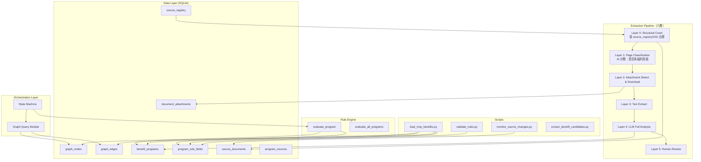
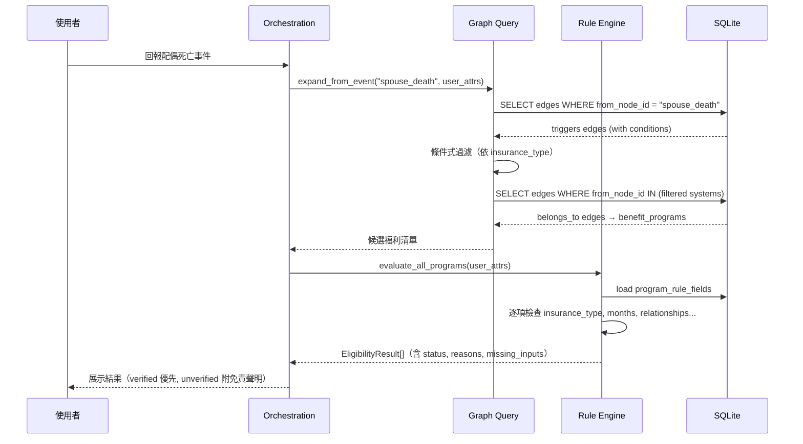

# 技術設計文件：資料層與規則引擎補齊

## Overview

本設計文件描述「資料層與規則引擎補齊」功能的技術架構，涵蓋 Entitlement Graph 關聯模型、Rule Engine 擴充、多層提取管線、來源監控、以及資料種子與驗證機制。

### 設計目標

1. **圖模型驅動**：以 SQLite `graph_nodes` + `graph_edges` 實作 Entitlement Graph，替代硬編碼的事件-福利對應邏輯
2. **資料驅動的資格判斷**：擴充既有 Rule Engine 支援 insurance_type、insurance_months、eligible_relationships 三大新條件
3. **六層提取管線**：以 OID registry 中的完整機關清單為母體，透過 Structural Crawl 系統性發現頁面，再經 AI 分類、附件處理、LLM 分析與人工審查，實現 Coverage Guarantee
4. **來源可追溯性**：每筆規則欄位附帶官方文件原文引用（source_excerpt）
5. **Mock-First**：所有功能在本機 SQLite 執行，不依賴 AWS 服務（Aug 1 前）

### 核心設計決策

| 決策 | 選項 | 理由 |
|------|------|------|
| 圖儲存 | SQLite 關聯表（非圖資料庫） | 專案已使用 SQLite，節點/邊數量 MVP 規模 < 100，不需 Neo4j 等外部依賴 |
| 條件式展開 | JSON condition on edges | 比在 Python 硬編碼更靈活，新增事件只需新增資料列 |
| 附件處理 | pdfplumber + python-docx | 純 Python、無系統依賴，適合 hackathon 快速開發 |
| LLM 提取 | Amazon Bedrock（boto3 mock） | 符合 hackathon 技術需求，Aug 1 前用 mock 回應 |
| 驗證方式 | CLI script + JSON 評測案例 | 易於 CI 整合，不需額外測試框架 |

---

## Architecture

### 高層架構圖



### 資料流程圖



---

## Components and Interfaces

### 1. Graph Query Module

**檔案路徑**：`backend/app/services/entitlement_graph.py`

此模組封裝 Entitlement Graph 的查詢邏輯，提供三個核心函式供 orchestration 使用。

```python
@dataclass(frozen=True)
class GraphNode:
    node_id: str
    node_type: str  # life_event | insurance_system | benefit_program | agency | document_requirement
    display_name: str
    metadata: dict[str, Any] | None = None

@dataclass(frozen=True)
class GraphEdge:
    from_node_id: str
    to_node_id: str
    edge_type: str  # triggers | belongs_to | requires | produces | administered_by
    condition: dict[str, str] | None = None
    order: int = 0
    metadata: dict[str, Any] | None = None


def expand_from_event(
    connection: sqlite3.Connection,
    event_id: str,
    user_attributes: dict[str, Any],
) -> list[GraphNode]:
    """從人生事件節點展開，回傳經條件過濾後的所有 benefit_program 節點。

    展開邏輯：
    1. 找到 event_id 的所有 triggers 邊
    2. 對每條邊評估 condition_json：
       - condition 為 NULL → 通過
       - 使用者未提供該 attribute → 通過（保守策略）
       - 使用者已提供且值匹配 → 通過
       - 使用者已提供但值不匹配 → 跳過
    3. 對通過的目標節點，找到所有 belongs_to 邊指向的 benefit_program 節點
    4. 依 order 排序後回傳
    """
    ...


def get_prerequisites(
    connection: sqlite3.Connection,
    program_node_id: str,
) -> list[GraphNode]:
    """回傳該福利方案的所有前置 document_requirement 節點。

    查詢 edge_type = 'requires' 且 from_node_id = program_node_id 的邊，
    回傳 to_node_id 對應的 GraphNode，依 order 排序。
    """
    ...


def get_produces(
    connection: sqlite3.Connection,
    program_node_id: str,
) -> list[GraphNode]:
    """回傳該福利方案完成後產出的所有 document_requirement 節點。

    查詢 edge_type = 'produces' 且 from_node_id = program_node_id 的邊，
    回傳 to_node_id 對應的 GraphNode，依 order 排序。
    """
    ...


def get_programs_by_system(
    connection: sqlite3.Connection,
    system_node_id: str,
) -> list[GraphNode]:
    """反向查詢：給定 insurance_system 節點，回傳所有 belongs_to 該系統的 benefit_program。"""
    ...
```

### 2. Rule Engine 擴充

**檔案路徑**：`backend/app/rules/engine.py`（修改既有檔案）

在 `evaluate_program()` 函式中新增三個檢查步驟，插入於既有步驟 2（城市設籍）之後：

```python
# 新增步驟 2a: 檢查投保身分（insurance_type）
eligible_types = rules.get("eligible_insurance_types")
if eligible_types:
    user_insurance = user_attrs.get("insurance_type")
    if user_insurance is None:
        missing_inputs.append("insurance_type")
    elif user_insurance not in eligible_types:
        return EligibilityResult(
            program_id=program_id,
            program_name=program_name,
            status="ineligible",
            reasons=["投保身分不符合此方案要求"],
            source_url=source_url,
        )

# 新增步驟 2b: 檢查投保月數（min_insurance_months）
min_months = rules.get("min_insurance_months")
if min_months is not None:
    user_months = user_attrs.get("insurance_months")
    if user_months is None:
        missing_inputs.append("insurance_months")
    elif user_months < min_months:
        return EligibilityResult(
            program_id=program_id,
            program_name=program_name,
            status="ineligible",
            reasons=[f"投保月數不足（需至少 {min_months} 個月）"],
            source_url=source_url,
        )

# 新增步驟 2c: 檢查親屬關係（eligible_relationships）
eligible_rels = rules.get("eligible_relationships")
if eligible_rels:
    user_rel = user_attrs.get("relationship_to_deceased")
    if user_rel is None:
        missing_inputs.append("relationship_to_deceased")
    elif user_rel not in eligible_rels:
        return EligibilityResult(
            program_id=program_id,
            program_name=program_name,
            status="ineligible",
            reasons=["申請人與亡者關係不符合申請資格"],
            source_url=source_url,
        )
```

### 3. 未審查方案處理邏輯

在 `evaluate_all_programs()` 中新增 program_status 檢查：

```python
def evaluate_all_programs(
    connection: sqlite3.Connection,
    user_attrs: dict[str, Any],
    jurisdiction: str | None = None,
) -> list[EligibilityResult]:
    # ... 載入 programs ...
    for prog in programs:
        pid, name, prog_jurisdiction = prog
        # 查詢 program_status
        status_row = connection.execute(
            "SELECT program_status FROM benefit_programs WHERE program_id = ?",
            (pid,)
        ).fetchone()
        program_status = status_row[0] if status_row else "candidate"

        if program_status in ("candidate", "under_review"):
            # 不執行完整資格判斷，回傳 needs_human_review
            results.append(EligibilityResult(
                program_id=pid,
                program_name=name,
                status="needs_human_review",
                relevance_score=0,  # 排序在 verified 之後
                reasons=["可能相關，建議洽詢承辦機關"],
                source_url="",
            ))
            continue

        # verified → 執行完整資格判斷（既有邏輯）
        ...

    # 排序：verified 優先（by relevance_score desc），
    # 再 candidate/under_review（by name）
    results.sort(key=lambda r: (
        0 if r.status != "needs_human_review" else 1,
        -r.relevance_score,
        r.program_name,
    ))
```

### 4. 多層提取管線（六層架構）

**檔案路徑**：`backend/app/extraction/` 目錄（新建）

```
backend/app/extraction/
├── __init__.py
├── structural_crawler.py  # Layer 0: 結構性爬取（從 source_registry/OID 出發）
├── page_classifier.py     # Layer 1: AI 頁面分類
├── pipeline.py            # Layer 2-4 管線協調器
├── attachment_detector.py # Layer 2: 附件偵測與下載
├── text_extractor.py      # Layer 3: PDF/DOCX 文本提取
├── llm_analyzer.py        # Layer 4: LLM 分析（Bedrock）
└── models.py              # 共用資料模型
```

#### Layer 0：結構性爬取（Structural Crawl）

**檔案路徑**：`backend/app/extraction/structural_crawler.py`

Layer 0 是整個提取管線的基礎。系統不依賴搜尋引擎或 SEO 排名來「找到」福利頁面，而是從 OID registry 中已登記的公部門機關清單出發，系統性爬取每個機關的官方網站，發現所有子頁面。

**核心設計理念**：
- 輸入來源為 `source_registry` 資料表（源自 OID registry 的完整機關清單）
- 從每個機關的 `entry_url`（官方網站首頁）出發
- 依網站結構逐層展開：福利專區、申辦服務、公告、最新消息等導覽連結
- 將所有發現的 URL 記錄至 `source_documents` 資料表
- **不使用搜尋引擎、不使用關鍵字搜尋、不依賴 SEO**
- 遵守 robots.txt 與爬取頻率限制

```python
# backend/app/extraction/structural_crawler.py

from dataclasses import dataclass
from datetime import datetime

@dataclass
class CrawlReport:
    agency_count: int
    urls_discovered: int
    urls_new: int
    urls_already_known: int
    errors: list[dict[str, str]]
    started_at: datetime
    completed_at: datetime


class StructuralCrawler:
    """Layer 0: 從 source_registry 中已登記機關的官方網站出發，
    依網站結構系統性發現子頁面。

    設計原則：
    - 不依賴搜尋引擎或關鍵字搜尋
    - 以 OID registry 的完整機關清單為爬取範圍母體
    - 從每個機關的 entry_url 出發，跟隨導覽連結
    - 遵守 robots.txt 與爬取頻率限制（rate limiting）
    """

    def __init__(
        self,
        connection: sqlite3.Connection,
        rate_limit_seconds: float = 1.0,
        max_depth: int = 3,
    ):
        self.connection = connection
        self.rate_limit_seconds = rate_limit_seconds
        self.max_depth = max_depth

    def crawl_agency(self, source_id: str) -> list[str]:
        """爬取單一機關的官方網站，從 entry_url 出發跟隨導覽連結。

        流程：
        1. 從 source_registry 取得該機關的 entry_url
        2. 抓取首頁 HTML，解析導覽結構
        3. 識別福利/服務相關區塊連結（福利專區、申辦服務、公告等）
        4. 逐層展開子頁面（至 max_depth 層）
        5. 將所有發現的 URL 記錄至 source_documents（review_status = 'candidate'）
        6. 遵守 robots.txt 規則與 rate_limit_seconds 間隔

        Returns:
            list[str]: 本次新發現的 URL 清單
        """
        ...

    def crawl_all_pending(self) -> CrawlReport:
        """爬取所有尚未爬取或已到期需重新爬取的機關官網。

        選擇機關的條件：
        - source_registry 中 crawl_status = 'pending_crawl' 的機關
        - 或 last_crawled_at 早於 check_frequency 對應的時間間隔

        Returns:
            CrawlReport: 爬取結果摘要
        """
        ...

    def _should_recrawl(self, source_id: str) -> bool:
        """依據 check_frequency 判斷該機關是否需要重新爬取。

        - daily: last_crawled_at > 24 小時前
        - weekly: last_crawled_at > 7 天前
        - monthly: last_crawled_at > 30 天前
        - manual: 永不自動重新爬取
        """
        ...

    def _discover_navigation_links(self, html: str, base_url: str) -> list[str]:
        """從 HTML 中識別導覽結構連結。

        目標區塊關鍵字（繁體中文）：
        - 福利專區、社會福利、補助方案
        - 申辦服務、線上申辦
        - 最新公告、最新消息
        - 便民服務、為民服務
        """
        ...

    def _respect_robots_txt(self, base_url: str, target_url: str) -> bool:
        """檢查 robots.txt 是否允許爬取該 URL。"""
        ...
```

#### Layer 1：頁面分類（Page Classification）

**檔案路徑**：`backend/app/extraction/page_classifier.py`

Layer 0 發現的所有 URL 會由 AI 進行分類，判斷每個頁面是否為福利方案頁面。

```python
# backend/app/extraction/page_classifier.py

class PageClassifier:
    """Layer 1: AI 分類 — 判斷 Layer 0 發現的 URL 是否為福利方案頁面。"""

    def classify_page(self, document_id: str) -> str:
        """對單一頁面進行分類。

        Returns:
            'yes' | 'no' | 'maybe' — 該頁面是否為福利方案頁面
        """
        ...

    def classify_batch(self) -> dict[str, int]:
        """批次分類所有尚未分類的 source_documents。

        Returns:
            {'yes': N, 'no': N, 'maybe': N} 分類統計
        """
        ...
```

#### Layer 2-4：提取管線協調器

```python
# backend/app/extraction/pipeline.py

@dataclass
class ExtractionResult:
    document_id: str
    confidence: str  # partial | high_from_html | high_from_full | partial_ocr_needed
    candidate: dict[str, Any] | None  # 結構化候選，或 None（非福利頁面）
    attachments: list[AttachmentMeta]
    errors: list[str]

class ExtractionPipeline:
    """管理 Layer 2（附件偵測）→ Layer 3（文本提取）→ Layer 4（LLM 分析）流程。

    僅處理 Layer 1 分類為 'yes' 或 'maybe' 的頁面。
    """

    def __init__(
        self,
        connection: sqlite3.Connection,
        bedrock_client: Any,  # boto3 bedrock-runtime 或 mock
        attachment_dir: Path = Path("data/local/attachments/"),
    ):
        self.connection = connection
        self.bedrock_client = bedrock_client
        self.attachment_dir = attachment_dir

    def process_document(self, document_id: str) -> ExtractionResult:
        """Layer 2-4 提取流程（僅處理已分類為福利頁面的文件）。"""
        # Layer 2: 偵測附件連結
        html_content = self._fetch_html(document_id)
        attachments = self._detect_attachments(document_id, html_content)
        has_unprocessed_attachments = False

        # Layer 3: 提取附件文字
        attachment_texts = []
        for att in attachments:
            try:
                text = self._extract_attachment_text(att)
                attachment_texts.append(text)
            except ExtractionError as e:
                has_unprocessed_attachments = True
                self._log_error(document_id, str(e))

        # Layer 4: LLM 分析
        candidate = self._llm_analyze(html_content, attachment_texts)

        # 決定信心等級
        if candidate is None:
            confidence = "high_from_html"  # 非福利頁面
        elif has_unprocessed_attachments:
            confidence = "partial"
        elif attachments and all(a.extracted_text_available for a in attachments):
            confidence = "high_from_full"
        elif attachments:
            confidence = "partial"
        else:
            confidence = "high_from_html"

        return ExtractionResult(
            document_id=document_id,
            confidence=confidence,
            candidate=candidate,
            attachments=attachments,
            errors=[],
        )

    def process_batch(self) -> list[ExtractionResult]:
        """批次處理所有已分類為 'yes'/'maybe' 且尚未提取的 source_documents。"""
        ...
```

### 5. 來源監控腳本

**檔案路徑**：`scripts/monitor_source_changes.py`

> **注意**：此腳本的職責是偵測「已知文件的內容是否變更」（content hash 比對），
> 與 Layer 0 Structural Crawl 的職責不同。Structural Crawl 負責「發現新頁面」，
> 來源監控負責「偵測已知頁面內容異動」。

```python
# 核心邏輯虛擬碼
def monitor_sources(connection, dry_run=False):
    # 1. 查詢需檢查的文件
    docs = query_documents_to_check(connection)

    if dry_run:
        print_document_list(docs)
        return

    # 2. 記錄 sync_run
    sync_run_id = create_sync_run(connection)

    # 3. 逐一抓取與比較
    changed = []
    errors = []
    for doc in docs:
        try:
            new_content = fetch_url(doc.canonical_url)
            new_hash = hashlib.sha256(new_content).hexdigest()
            if new_hash != doc.current_content_hash:
                mark_document_stale(connection, doc.document_id, new_hash)
                changed.append(doc)
        except Exception as e:
            errors.append((doc, e))

    # 4. 更新 sync_run 狀態
    complete_sync_run(connection, sync_run_id, len(changed), len(errors))

    # 5. 輸出報告
    print_change_report(changed, errors)
    return len(errors) > 0  # 非零 exit code if errors
```

### 6. 驗證腳本

**檔案路徑**：`scripts/validate_rules.py`

```python
@dataclass
class ValidationIssue:
    program_id: str
    field_name: str
    severity: str  # "error" | "warning"
    message: str

def validate_all_rules(connection: sqlite3.Connection) -> list[ValidationIssue]:
    """驗證所有 program_rule_fields 的完整性與一致性。"""
    issues = []

    # 1. 每個 under_review/verified program 至少有 1 筆 rule_field
    programs = get_active_programs(connection)
    for program in programs:
        fields = get_rule_fields(connection, program.program_id)
        if not fields:
            issues.append(ValidationIssue(
                program.program_id, "", "error",
                "該方案在 program_rule_fields 中無任何記錄"
            ))
            continue

        for field in fields:
            # 2. field_type 合法性
            if field.field_type not in VALID_FIELD_TYPES:
                issues.append(...)

            # 3. JSON 欄位可解析
            if field.field_type == "json":
                try:
                    json.loads(field.field_value)
                except json.JSONDecodeError:
                    issues.append(...)

            # 4. integer 欄位可轉換
            if field.field_type == "integer":
                try:
                    int(field.field_value)
                except ValueError:
                    issues.append(...)

            # 5. source_excerpt 非空且長度 >= 10
            if not field.source_excerpt or len(field.source_excerpt.strip()) < 10:
                issues.append(ValidationIssue(
                    program.program_id, field.field_name, "warning",
                    "source_excerpt 為空或長度不足 10 字元"
                ))

    return issues
```

### 7. 資料種子腳本

**檔案路徑**：`scripts/load_mvp_benefits.py`

**種子檔案路徑**：`data/benefits/mvp_programs.v0.1.json`（包含 6 項核心福利 + graph 資料）

```python
def load_mvp_benefits(connection, seed_path):
    seed = json.loads(seed_path.read_text())

    # 冪等策略：INSERT OR IGNORE for programs, graph_nodes
    # UPDATE only seed-controlled fields for rule_fields

    stats = {"programs": 0, "rule_fields": 0, "nodes": 0, "edges": 0, ...}

    for program in seed["programs"]:
        if insert_program_if_new(connection, program):
            stats["programs"] += 1
        for field in program["rule_fields"]:
            if insert_or_update_rule_field(connection, program["program_id"], field):
                stats["rule_fields"] += 1

    for node in seed["graph_nodes"]:
        if insert_node_if_new(connection, node):
            stats["nodes"] += 1

    for edge in seed["graph_edges"]:
        if insert_edge_if_new(connection, edge):
            stats["edges"] += 1

    return stats
```

---

## Data Models

### SQLite Schema 新增

#### graph_nodes 資料表

```sql
CREATE TABLE IF NOT EXISTS graph_nodes (
    node_id TEXT PRIMARY KEY,
    node_type TEXT NOT NULL
        CHECK (node_type IN (
            'life_event', 'insurance_system', 'benefit_program',
            'agency', 'document_requirement'
        )),
    display_name TEXT NOT NULL,
    metadata_json TEXT,
    created_at TEXT NOT NULL,
    updated_at TEXT NOT NULL
);

CREATE INDEX IF NOT EXISTS idx_graph_nodes_type
    ON graph_nodes (node_type);
```

#### graph_edges 資料表

```sql
CREATE TABLE IF NOT EXISTS graph_edges (
    from_node_id TEXT NOT NULL,
    to_node_id TEXT NOT NULL,
    edge_type TEXT NOT NULL
        CHECK (edge_type IN (
            'triggers', 'belongs_to', 'requires',
            'produces', 'administered_by'
        )),
    condition_json TEXT,
    "order" INTEGER NOT NULL DEFAULT 0,
    metadata_json TEXT,
    created_at TEXT NOT NULL,
    PRIMARY KEY (from_node_id, to_node_id, edge_type),
    FOREIGN KEY (from_node_id) REFERENCES graph_nodes (node_id)
        ON DELETE RESTRICT,
    FOREIGN KEY (to_node_id) REFERENCES graph_nodes (node_id)
        ON DELETE RESTRICT
);

CREATE INDEX IF NOT EXISTS idx_graph_edges_from
    ON graph_edges (from_node_id);
CREATE INDEX IF NOT EXISTS idx_graph_edges_to
    ON graph_edges (to_node_id);
CREATE INDEX IF NOT EXISTS idx_graph_edges_type
    ON graph_edges (edge_type);
```

#### document_attachments 資料表

```sql
CREATE TABLE IF NOT EXISTS document_attachments (
    attachment_id TEXT PRIMARY KEY,
    document_id TEXT NOT NULL,
    filename TEXT NOT NULL,
    file_type TEXT NOT NULL
        CHECK (file_type IN ('pdf', 'docx', 'odt', 'xlsx', 'other')),
    download_url TEXT NOT NULL,
    storage_ref TEXT,
    content_hash TEXT,
    extracted_text_available INTEGER NOT NULL DEFAULT 0
        CHECK (extracted_text_available IN (0, 1)),
    extraction_method TEXT,
    extracted_at TEXT,
    created_at TEXT NOT NULL,
    FOREIGN KEY (document_id) REFERENCES source_documents (document_id)
        ON DELETE RESTRICT
);

CREATE INDEX IF NOT EXISTS idx_document_attachments_document
    ON document_attachments (document_id);
```

#### source_registry 新增欄位

```sql
ALTER TABLE source_registry
    ADD COLUMN check_frequency TEXT NOT NULL DEFAULT 'manual'
        CHECK (check_frequency IN ('daily', 'weekly', 'monthly', 'manual'));

-- check_frequency 語義：多久重新爬取該機關的官方網站以發現「新頁面」
-- 非指特定文件的內容檢查頻率
-- daily: 中央政府福利索引（如我的E政府、勞動部、衛福部主要入口頁）
-- weekly: 直轄市/縣市政府福利頁面
-- monthly: 特定機關方案頁面
-- manual: MVP 階段預設，不自動排程爬取

ALTER TABLE source_registry
    ADD COLUMN crawl_status TEXT NOT NULL DEFAULT 'pending_crawl'
        CHECK (crawl_status IN ('pending_crawl', 'crawled', 'error'));

ALTER TABLE source_registry
    ADD COLUMN last_crawled_at TEXT;

ALTER TABLE source_registry
    ADD COLUMN entry_url TEXT;  -- 機關官方網站首頁 URL（Structural Crawl 起點）
```

### MVP Entitlement Graph 資料

#### Graph Nodes（配偶死亡情境）

| node_id | node_type | display_name |
|---------|-----------|--------------|
| spouse_death | life_event | 配偶死亡 |
| labor_insurance | insurance_system | 勞工保險 |
| national_pension | insurance_system | 國民年金保險 |
| nhi | insurance_system | 全民健康保險 |
| household_registration | agency | 戶政事務所 |
| death_certificate | document_requirement | 死亡證明書 |
| death_registration | benefit_program | 死亡登記 |
| labor_funeral_grant | benefit_program | 勞保喪葬給付 |
| national_pension_funeral_grant | benefit_program | 國保喪葬給付 |
| labor_survivor_pension | benefit_program | 勞保遺屬年金 |
| national_pension_survivor_pension | benefit_program | 國保遺屬年金 |
| nhi_status_change | benefit_program | 健保身分變更 |

#### Graph Edges（配偶死亡情境）

| from_node_id | to_node_id | edge_type | condition_json | order |
|--------------|------------|-----------|----------------|-------|
| spouse_death | labor_insurance | triggers | `{"attribute": "insurance_type", "value": "labor_insurance"}` | 1 |
| spouse_death | national_pension | triggers | `{"attribute": "insurance_type", "value": "national_pension"}` | 2 |
| spouse_death | nhi | triggers | NULL | 3 |
| spouse_death | household_registration | triggers | NULL | 0 |
| labor_insurance | labor_funeral_grant | belongs_to | NULL | 1 |
| labor_insurance | labor_survivor_pension | belongs_to | NULL | 2 |
| national_pension | national_pension_funeral_grant | belongs_to | NULL | 1 |
| national_pension | national_pension_survivor_pension | belongs_to | NULL | 2 |
| nhi | nhi_status_change | belongs_to | NULL | 1 |
| household_registration | death_registration | belongs_to | NULL | 1 |
| death_registration | death_certificate | produces | NULL | 1 |
| labor_funeral_grant | death_certificate | requires | NULL | 1 |
| labor_survivor_pension | death_certificate | requires | NULL | 1 |

### 條件式展開演算法

```
function expand_from_event(event_id, user_attributes):
    # Step 1: 取得所有 triggers 邊
    triggers_edges = SELECT * FROM graph_edges
                     WHERE from_node_id = event_id AND edge_type = 'triggers'
                     ORDER BY "order"

    # Step 2: 條件過濾
    valid_targets = []
    for edge in triggers_edges:
        if edge.condition_json is NULL:
            valid_targets.append(edge.to_node_id)
        else:
            condition = json.loads(edge.condition_json)
            attr_name = condition["attribute"]
            attr_value = condition["value"]
            user_value = user_attributes.get(attr_name)
            if user_value is None:
                # 使用者尚未提供 → 保守策略，遍歷
                valid_targets.append(edge.to_node_id)
            elif user_value == attr_value:
                # 匹配 → 遍歷
                valid_targets.append(edge.to_node_id)
            else:
                # 不匹配 → 跳過
                pass

    # Step 3: 找到所有 belongs_to 的 benefit_program
    programs = []
    for target_id in valid_targets:
        belongs_edges = SELECT * FROM graph_edges
                        WHERE from_node_id = target_id AND edge_type = 'belongs_to'
                        ORDER BY "order"
        for edge in belongs_edges:
            node = SELECT * FROM graph_nodes WHERE node_id = edge.to_node_id
            programs.append(node)

    return programs
```

### MVP Rule Fields 結構

以 `labor_funeral_grant` 為範例：

```json
{
  "program_id": "labor_funeral_grant",
  "rule_fields": [
    {
      "field_name": "required_attributes",
      "field_type": "json",
      "field_value": "[\"insurance_type\", \"insurance_months\", \"death_date\", \"relationship_to_deceased\"]",
      "source_excerpt": "被保險人之父母、配偶或子女死亡時，得請領喪葬津貼（勞工保險條例第62條）"
    },
    {
      "field_name": "eligible_insurance_types",
      "field_type": "json",
      "field_value": "[\"labor_insurance\"]",
      "source_excerpt": "被保險人參加勞工保險期間，其父母、配偶或子女死亡時"
    },
    {
      "field_name": "min_insurance_months",
      "field_type": "integer",
      "field_value": "1",
      "source_excerpt": "被保險人在保險有效期間"
    },
    {
      "field_name": "eligible_relationships",
      "field_type": "json",
      "field_value": "[\"spouse\", \"parent\", \"child\"]",
      "source_excerpt": "被保險人之父母、配偶或子女死亡時"
    },
    {
      "field_name": "application_deadline_days",
      "field_type": "integer",
      "field_value": "730",
      "source_excerpt": "請求權自得請領之日起，因五年間不行使而消滅（勞工保險條例第30條，實務上以2年為建議期限）"
    },
    {
      "field_name": "deadline_starts_from",
      "field_type": "text",
      "field_value": "death_date",
      "source_excerpt": "自死亡之日起計算"
    },
    {
      "field_name": "min_amount",
      "field_type": "integer",
      "field_value": "0",
      "source_excerpt": "按被保險人平均月投保薪資發給"
    },
    {
      "field_name": "max_amount",
      "field_type": "integer",
      "field_value": "0",
      "source_excerpt": "配偶死亡—3個月平均月投保薪資"
    },
    {
      "field_name": "amount_conditions",
      "field_type": "json",
      "field_value": "[{\"condition\": \"relationship_to_deceased=spouse\", \"amount\": 0, \"label\": \"3個月平均月投保薪資\"}, {\"condition\": \"relationship_to_deceased=parent\", \"amount\": 0, \"label\": \"3個月平均月投保薪資\"}, {\"condition\": \"relationship_to_deceased=child\", \"amount\": 0, \"label\": \"2.5或1.5個月平均月投保薪資\"}]",
      "source_excerpt": "父母或配偶死亡時，按其平均月投保薪資，發給三個月。子女年滿十二歲者2.5個月，未滿者1.5個月。"
    }
  ]
}
```

### 評測案例格式

```json
{
  "schema_version": "1.0",
  "evaluation_id": "mvp_eligibility_test_set",
  "evaluation_version": "0.1",
  "locale": "zh-TW",
  "fixture_type": "eligibility_evaluation_cases",
  "notes": [
    "這些案例用於驗證 Rule Engine 的資格判斷邏輯正確性",
    "不代表實際使用者情境，僅為自動化測試用途",
    "金額欄位因依投保薪資計算，此處僅驗證 status 與 reasons"
  ],
  "cases": [
    {
      "case_id": "labor_funeral_001",
      "title": "勞保喪葬給付—配偶死亡，正常符合資格",
      "program_id": "labor_funeral_grant",
      "user_attributes": {
        "insurance_type": "labor_insurance",
        "insurance_months": 120,
        "death_date": "2026-06-15",
        "relationship_to_deceased": "spouse",
        "days_since_death_date": 30
      },
      "expected_status": "eligible",
      "expected_reasons": []
    }
  ]
}
```

---

## Coverage Guarantee（覆蓋保證）

### 核心價值主張

本系統的核心價值在於**窮舉式發現所有公部門福利資源**，而非依賴外部搜尋引擎的排名結果。

### 與其他方案的差異

| 方案 | 發現方式 | 覆蓋保證 | 限制 |
|------|----------|----------|------|
| ChatGPT / LLM | 依賴訓練資料 | 無保證，可能過時或遺漏 | 訓練截止日後的新方案看不到 |
| Google 搜尋 | SEO 排名 | 無保證，僅回傳排序靠前的結果 | 許多利基補助未被良好索引 |
| **本系統** | OID registry → Structural Crawl | **窮舉保證** | 需維護爬取排程與機關清單 |

### 實現機制


### SOP 完整流程

1. **OID registry** 提供完整公部門機關清單
2. **source_registry** 儲存每個機關的 entry_url 與 check_frequency
3. **Structural Crawl（Layer 0）** 從每個機關的 entry_url 出發，依網站導覽結構逐層發現子頁面
4. **source_documents** 記錄所有發現的 URL（review_status = 'candidate'）
5. **AI 分類（Layer 1）** 判斷每個 URL 是否為福利方案頁面
6. **附件處理（Layer 2-3）** 偵測並下載附件、提取文字
7. **LLM 分析（Layer 4）** 結構化提取福利候選資料
8. **人工審查（Layer 5）** 確認候選資料正確性

### 爬取進度追蹤

每個機關在 `source_registry` 中以 `crawl_status` 追蹤爬取進度：

- **pending_crawl**：尚未爬取（新匯入的機關預設狀態）
- **crawled**：已完成至少一次爬取
- **error**：爬取失敗（需人工處理）

系統可隨時查詢「尚有多少機關未爬取」以追蹤覆蓋進度：

```sql
-- 查詢覆蓋進度
SELECT crawl_status, COUNT(*) as count
FROM source_registry
GROUP BY crawl_status;

-- 查詢未爬取的機關清單
SELECT source_id, canonical_name, entry_url
FROM source_registry
WHERE crawl_status = 'pending_crawl';
```

### check_frequency 語義

`check_frequency` 定義的是**多久重新爬取該機關官網以發現新頁面**，而非檢查特定文件的內容是否變更（那是 `monitor_source_changes.py` 的職責）。

| 等級 | 頻率 | 適用對象 |
|------|------|----------|
| daily | 每 24 小時 | 中央政府福利索引（我的E政府、勞動部、衛福部主要入口頁） |
| weekly | 每 7 天 | 直轄市/縣市政府福利頁面 |
| monthly | 每 30 天 | 特定機關方案頁面 |
| manual | 手動觸發 | MVP 階段所有來源的預設值 |

---

## Correctness Properties

*A property is a characteristic or behavior that should hold true across all valid executions of a system—essentially, a formal statement about what the system should do. Properties serve as the bridge between human-readable specifications and machine-verifiable correctness guarantees.*

### Property 1: 條件式邊遍歷正確性

*For any* graph edge with a non-NULL condition_json, and *for any* user_attributes dictionary:
- If the user has NOT provided the condition's attribute → the edge SHALL be traversed
- If the user has provided the attribute and the value matches → the edge SHALL be traversed
- If the user has provided the attribute but the value does NOT match → the edge SHALL NOT be traversed

**Validates: Requirements 1.4, 9.1, 9.2, 9.3**

### Property 2: 圖展開結果排序穩定性

*For any* life_event node and *for any* user_attributes, the result of `expand_from_event` SHALL be ordered by the `order` field of the traversed edges, and the result SHALL be deterministic (same inputs always produce the same output in the same order).

**Validates: Requirements 9.6**

### Property 3: 前置需求與產出查詢完整性

*For any* benefit_program node, `get_prerequisites(node_id)` SHALL return exactly the set of nodes reachable via `requires` edges from that node, and `get_produces(node_id)` SHALL return exactly the set of nodes reachable via `produces` edges from that node—no more, no less.

**Validates: Requirements 9.4, 9.5**

### Property 4: 投保身分資格判斷

*For any* program that defines `eligible_insurance_types` and *for any* user_attributes:
- If user provides `insurance_type` not in the eligible list → status SHALL be `ineligible`
- If user does not provide `insurance_type` → `insurance_type` SHALL appear in `missing_inputs` and status SHALL be `needs_information`
- If user provides `insurance_type` in the eligible list → this check SHALL pass (not block eligibility)

**Validates: Requirements 7.1, 7.2**

### Property 5: 投保月數資格判斷

*For any* program that defines `min_insurance_months` and *for any* integer value of `insurance_months`:
- If user's `insurance_months` < `min_insurance_months` → status SHALL be `ineligible`
- If user does not provide `insurance_months` → `insurance_months` SHALL appear in `missing_inputs`
- If user's `insurance_months` >= `min_insurance_months` → this check SHALL pass

**Validates: Requirements 7.3, 7.4**

### Property 6: 親屬關係資格判斷

*For any* program that defines `eligible_relationships` and *for any* `relationship_to_deceased` string:
- If user's relationship is not in the eligible list → status SHALL be `ineligible`
- If user does not provide relationship → `relationship_to_deceased` SHALL appear in `missing_inputs`
- If user's relationship is in the eligible list → this check SHALL pass

**Validates: Requirements 7.5**

### Property 7: 未審查方案不進行完整資格判斷

*For any* program with `program_status` in (`candidate`, `under_review`) and *for any* user_attributes, the Rule Engine SHALL return status `needs_human_review` with reasons containing "可能相關，建議洽詢承辦機關", and SHALL NOT evaluate insurance_type, insurance_months, or relationships checks.

**Validates: Requirements 10.1, 10.2, 10.3**

### Property 8: 已驗證方案排序優先

*For any* mixed set of programs containing both `verified` and `candidate`/`under_review` programs, the sorted result list SHALL place ALL verified programs before ALL unverified programs.

**Validates: Requirements 10.4, 10.5**

### Property 9: 規則驗證器偵測無效資料

*For any* `program_rule_fields` record where field_type is `json` but field_value is not valid JSON, OR field_type is `integer` but field_value is not a valid integer, the validate_rules script SHALL report an error for that record.

**Validates: Requirements 5.2, 3.9**

### Property 10: 種子腳本冪等性

*For any* valid seed file, executing the load script twice in succession SHALL produce the same database state as executing it once (no duplicate records, no changed review_status or program_status).

**Validates: Requirements 8.3**

---

## Error Handling

### Rule Engine 錯誤處理

| 情境 | 處理方式 |
|------|----------|
| program_rule_fields 無記錄 | 跳過該方案，不加入結果清單 |
| field_value JSON 解析失敗 | 記錄警告日誌，將該方案標記為 `needs_human_review` |
| 使用者缺少必要屬性 | 回傳 `needs_information` + `missing_inputs` 清單 |
| 資料庫連線失敗 | 拋出異常，由上層 orchestration 捕獲並回報使用者 |

### Graph Query 錯誤處理

| 情境 | 處理方式 |
|------|----------|
| event_id 不存在於 graph_nodes | 回傳空清單，記錄 warning |
| condition_json 格式錯誤 | 視為 NULL（保守策略，遍歷該邊），記錄 warning |
| 外鍵參照的節點不存在 | 由 SQLite FOREIGN KEY RESTRICT 阻止此狀態 |

### 提取管線錯誤處理

| 情境 | 處理方式 |
|------|----------|
| Layer 0: 機關 entry_url 無法存取 | 記錄錯誤，設 crawl_status = 'error'，繼續其餘機關 |
| Layer 0: robots.txt 禁止爬取 | 跳過該 URL，記錄日誌，繼續 |
| Layer 0: 爬取深度超過 max_depth | 停止該分支展開，記錄已發現的 URL |
| Layer 1: AI 分類 API 失敗 | 記錄錯誤，標記該頁面待重試，繼續批次 |
| Layer 2: HTML 抓取失敗（HTTP error） | 記錄錯誤，跳過該文件，繼續批次 |
| Layer 2: 附件下載失敗 | 記錄錯誤，設 confidence = `partial`，繼續 Layer 4 |
| Layer 3: PDF 文字提取失敗 | 記錄錯誤，設 confidence = `partial_ocr_needed`，繼續 |
| Layer 4: LLM 回應無法解析 | 記錄解析錯誤，跳過該文件，繼續批次 |
| Layer 4: LLM API 呼叫失敗 | 重試 1 次，若仍失敗則記錄錯誤並跳過 |

### 來源監控錯誤處理

| 情境 | 處理方式 |
|------|----------|
| 網路錯誤 | 記錄該文件錯誤，繼續處理其餘文件 |
| HTTP 非 200 回應 | 記錄錯誤（含 status code），繼續處理 |
| 任何文件有錯誤 | 最終以非零 exit code 結束 |
| content_hash 計算失敗 | 記錄錯誤，跳過該文件 |

### 資料種子腳本錯誤處理

| 情境 | 處理方式 |
|------|----------|
| 必要欄位缺失或空白 | 拒絕該筆記錄，輸出錯誤訊息，不中斷其餘 |
| JSON 種子檔案語法錯誤 | 拋出異常，中斷執行 |
| 資料庫連線失敗 | 拋出異常，中斷執行 |
| UNIQUE 約束衝突 | INSERT OR IGNORE（冪等策略） |

---

## Testing Strategy

### 測試方法概覽

本功能採用雙層測試策略：

1. **Property-Based Tests（屬性測試）**：驗證 Rule Engine 與 Graph Query 的通用正確性
2. **Unit Tests（單元測試）**：驗證特定情境、邊界條件與資料格式
3. **Integration Tests（整合測試）**：驗證端到端資料流程（含 SQLite）

### Property-Based Testing 適用性評估

本功能的核心邏輯（Rule Engine 資格判斷、Graph 條件式展開）是純函式或近純函式（輸入為使用者屬性 + 規則資料，輸出為判斷結果），非常適合 PBT：
- 輸入空間大：使用者屬性組合多（insurance_type × insurance_months × relationships × deadline）
- 有明確的通用性質：「任何不在 eligible list 的 insurance_type 都應回傳 ineligible」
- 成本低：全為記憶體內計算，100+ iterations 無成本壓力

**不適用 PBT 的部分**：
- 多層提取管線（涉及網路 I/O、LLM 呼叫）→ 用 mock-based integration tests
- Structural Crawl Layer 0（涉及網路 I/O、HTML 解析）→ 用 mock-based integration tests
- 來源監控腳本（涉及網路抓取）→ 用 mock-based integration tests
- 資料庫 schema 驗證 → 用 example-based tests

### Property-Based Testing 工具

- **Library**: [Hypothesis](https://hypothesis.readthedocs.io/) (Python PBT 標準選擇)
- **最小迭代次數**: 100 iterations per property
- **Tag 格式**: `# Feature: data-layer-rule-engine, Property {N}: {property_text}`

### 測試檔案結構

```
backend/tests/
├── unit/
│   ├── test_entitlement_graph.py      # Graph query unit tests
│   ├── test_rule_engine_extensions.py # Rule Engine 新增邏輯 unit tests
│   ├── test_structural_crawler.py     # Layer 0 爬取邏輯 unit tests
│   ├── test_page_classifier.py        # Layer 1 分類邏輯 unit tests
│   ├── test_validate_rules.py         # 驗證腳本 unit tests
│   └── test_seed_loader.py            # 種子腳本 unit tests
├── property/
│   ├── test_graph_traversal_props.py  # Property 1, 2, 3
│   ├── test_rule_engine_props.py      # Property 4, 5, 6, 7, 8
│   ├── test_validator_props.py        # Property 9
│   └── test_seed_idempotency_props.py # Property 10
└── integration/
    ├── test_extraction_pipeline.py    # 多層提取管線（mock LLM）
    ├── test_structural_crawl.py       # Layer 0 爬取整合測試（mock HTTP）
    ├── test_source_monitor.py         # 來源監控（mock HTTP）
    └── test_mvp_eligibility.py        # MVP 評測案例端到端驗證
```

### Property Test 實作指引

每個 property test 須：
1. 使用 Hypothesis `@given` 裝飾器
2. 以 `@settings(max_examples=100)` 設定最小迭代次數
3. 在 docstring 或註解中標註對應的 design property
4. 使用 `@example` 裝飾器覆蓋已知邊界案例

範例：

```python
from hypothesis import given, settings, example
from hypothesis.strategies import text, sampled_from, none, one_of

@given(
    insurance_type=one_of(
        sampled_from(["labor_insurance", "national_pension", "invalid_type"]),
        none(),
    ),
    eligible_list=st.lists(
        sampled_from(["labor_insurance", "national_pension"]),
        min_size=1, max_size=2,
    ),
)
@settings(max_examples=100)
def test_insurance_type_eligibility_property(insurance_type, eligible_list):
    """Feature: data-layer-rule-engine, Property 4: 投保身分資格判斷"""
    rules = {"eligible_insurance_types": eligible_list}
    user_attrs = {}
    if insurance_type is not None:
        user_attrs["insurance_type"] = insurance_type

    result = evaluate_program("test_prog", "Test", rules, user_attrs)

    if insurance_type is None:
        assert result.status == "needs_information"
        assert "insurance_type" in result.missing_inputs
    elif insurance_type in eligible_list:
        # This check passes (other checks may still fail)
        assert result.status != "ineligible" or "投保身分" not in str(result.reasons)
    else:
        assert result.status == "ineligible"
        assert any("投保身分" in r for r in result.reasons)
```

### Unit Test 覆蓋範圍

| 模組 | 測試重點 |
|------|----------|
| entitlement_graph.py | expand_from_event 特定情境、空圖處理、無效 event_id |
| engine.py 擴充 | MVP 6 項福利的具體案例、邊界日期、複合條件 |
| validate_rules.py | 各類錯誤偵測、警告輸出格式、exit code |
| load_mvp_benefits.py | 種子格式驗證、冪等插入、缺欄位拒絕 |

### Integration Test 覆蓋範圍

| 測試 | 策略 |
|------|------|
| MVP 評測案例 | 載入種子資料 → 執行 evaluate_all_programs → 比對 expected_status |
| Structural Crawl | Mock HTTP responses → 執行 crawl_agency → 驗證 URL 發現與 source_documents 記錄 |
| 提取管線 | Mock Bedrock client → 執行 process_document → 驗證候選輸出格式 |
| 頁面分類 | Mock LLM → 執行 classify_page → 驗證分類結果正確 |
| 來源監控 | Mock HTTP responses → 執行 monitor → 驗證 stale 標記 |

### 評測案例驅動測試

`data/evaluations/mvp_eligibility.v0.1.json` 中的 18+ 案例將作為 integration test 的測試資料：

```python
def test_mvp_eligibility_cases():
    """載入種子資料後，逐案驗證 Rule Engine 判斷結果。"""
    cases = load_evaluation_cases("data/evaluations/mvp_eligibility.v0.1.json")
    connection = setup_test_db_with_seeds()

    for case in cases:
        result = evaluate_program(
            case["program_id"],
            case["title"],
            load_program_rules(connection, case["program_id"]),
            case["user_attributes"],
        )
        assert result.status == case["expected_status"], (
            f"Case {case['case_id']}: expected {case['expected_status']}, "
            f"got {result.status}"
        )
```
