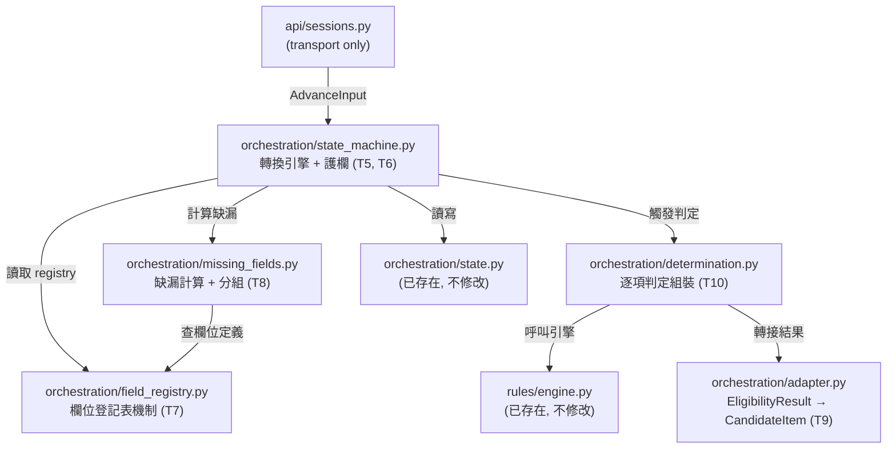
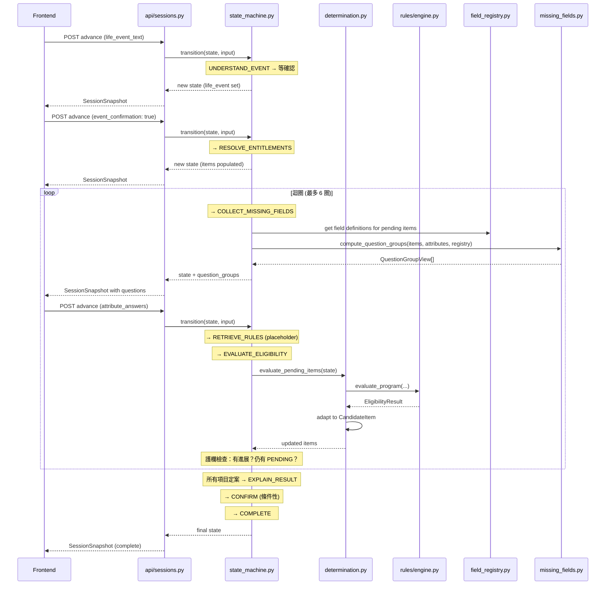
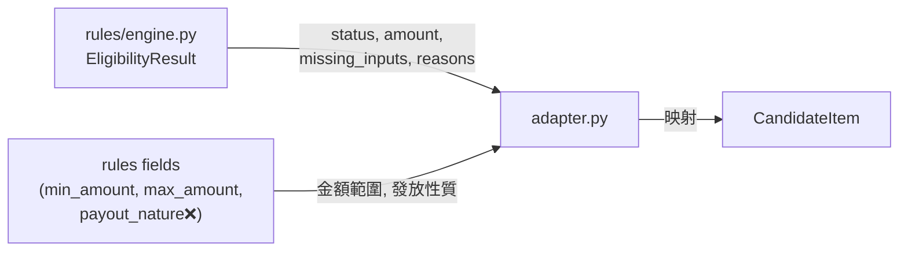

# 設計文件：Workflow Core State Machine（Phase 2, T5–T10）

## 概覽

本設計涵蓋後端 roadmap 階段 2 的六項任務（T5–T10），目標是讓整條福利導航流程在**沒有 AWS、沒有網路、沒有 LLM** 的環境下真正運作。核心是八個狀態的確定性轉換引擎、迴圈護欄、欄位登記表機制、缺漏欄位計算與主題分組、規則引擎轉接層、以及逐項判定組裝。

完成後，`orchestration/mock_advance.py` 將被刪除，前端從佔位資料升級為真實的狀態轉換結果。整個階段**不引入 AWS 依賴、不安裝 boto3、不呼叫 LLM**，並讓 LLM 與確定性規則的職責保持分離。

### 完成判準

以手寫規則跑完整條流程（UNDERSTAND_EVENT → COMPLETE），得到正確判定（eligible / ineligible / needs_information / needs_human_review）與決定性條件，全程離線。


## 架構



### 模組職責邊界

| 模組 | 負責 | 不負責 |
|------|------|--------|
| `state_machine.py` | 狀態轉換、守門條件、工具允許清單、護欄判斷、CONFIRM 跳過 | 欄位定義、資格判定、LLM 呼叫 |
| `field_registry.py` | 宣告欄位代號、型別、選項、對應的項目 | 欄位內容（由政策資料負責人填入） |
| `missing_fields.py` | 從 registry + attributes 算出缺哪些、按主題分組 | 問題文案（屬前端） |
| `adapter.py` | `EligibilityResult` → `CandidateItem` 的轉換 | 規則邏輯本身 |
| `determination.py` | 迴圈呼叫引擎、組裝定案結果、套用護欄 | 金額文案、白話解釋 |


## 序列圖：正常路徑（Happy Path）




## 元件與介面

### T5：狀態機轉換引擎

#### 轉換表

| 來源狀態 | 觸發條件 | 目標狀態 | 守門條件 |
|----------|----------|----------|----------|
| UNDERSTAND_EVENT | LifeEventTextInput | UNDERSTAND_EVENT | life_event 為 None |
| UNDERSTAND_EVENT | EventConfirmationInput(confirmed=True) | RESOLVE_ENTITLEMENTS | life_event 已設定 |
| UNDERSTAND_EVENT | EventConfirmationInput(confirmed=False) | UNDERSTAND_EVENT | retries < MAX |
| UNDERSTAND_EVENT | EventConfirmationInput(confirmed=False) | exit(EVENT_RETRY_LIMIT_REACHED) | retries >= MAX |
| RESOLVE_ENTITLEMENTS | (自動) | COLLECT_MISSING_FIELDS | items 已展開 |
| COLLECT_MISSING_FIELDS | AttributeAnswersInput | RETRIEVE_RULES | answers 合法 |
| RETRIEVE_RULES | (自動) | EVALUATE_ELIGIBILITY | — |
| EVALUATE_ELIGIBILITY | (自動) | COLLECT_MISSING_FIELDS | 仍有 PENDING 項目 |
| EVALUATE_ELIGIBILITY | (自動) | EXPLAIN_RESULT | 所有項目已定案 |
| EXPLAIN_RESULT | (自動) | CONFIRM | 有 needs_human_review 或需複查 |
| EXPLAIN_RESULT | (自動) | COMPLETE | 無需複查 |
| CONFIRM | ReviewConfirmationInput(confirmed=True) | COMPLETE | — |
| CONFIRM | ReviewConfirmationInput(confirmed=False) | COLLECT_MISSING_FIELDS | — |
| CONFIRM | ReferralChoiceInput | COMPLETE | — |
| (任何) | HelpRequestInput | exit(USER_REQUESTED_HELP) | — |
| (任何) | ItemDeclineInput | (same) | item_id 存在且非已定案 |

#### 工具允許清單（per-state tool allowlist）

```python
ALLOWED_INPUTS: dict[WorkflowState, frozenset[str]] = {
    WorkflowState.UNDERSTAND_EVENT: frozenset({
        "life_event_text", "event_confirmation", "help_request"
    }),
    WorkflowState.RESOLVE_ENTITLEMENTS: frozenset({
        "help_request"
    }),
    WorkflowState.COLLECT_MISSING_FIELDS: frozenset({
        "attribute_answers", "item_decline", "help_request"
    }),
    WorkflowState.RETRIEVE_RULES: frozenset({
        "help_request"
    }),
    WorkflowState.EVALUATE_ELIGIBILITY: frozenset({
        "help_request"
    }),
    WorkflowState.EXPLAIN_RESULT: frozenset({
        "help_request"
    }),
    WorkflowState.CONFIRM: frozenset({
        "review_confirmation", "referral_choice", "help_request"
    }),
    WorkflowState.COMPLETE: frozenset(),
}
```

#### CONFIRM 條件性跳過

```python
def should_skip_confirm(state: SessionState) -> bool:
    """CONFIRM 在以下情況全部不成立時被跳過：
    1. 沒有任何項目是 NEEDS_HUMAN_REVIEW
    2. 沒有需要使用者複查修正的答案（Phase 2 先永遠為 False）
    """
    has_human_review = any(
        item.status == ItemStatus.NEEDS_HUMAN_REVIEW
        for item in state.items
    )
    return not has_human_review
```


### T6：迴圈四道護欄

```python
@dataclass(frozen=True)
class LoopGuardrails:
    """迴圈護欄的政策參數。與 state 形狀分開，因為這是政策不是資料。"""
    max_iterations: int = 6

class GuardrailVerdict(StrEnum):
    CONTINUE = "continue"           # 可以再繞一圈
    EXIT_LOOP_LIMIT = "exit_loop_limit"
    EXIT_NO_PROGRESS = "exit_no_progress"

def check_guardrails(
    prev_state: SessionState,
    curr_state: SessionState,
    guardrails: LoopGuardrails,
) -> GuardrailVerdict:
    """每圈結束時檢查四道護欄。"""
    ...
```

#### 四道護欄規格

| # | 護欄 | 檢查時機 | 不通過的結果 |
|---|------|----------|-------------|
| 1 | **檢索先行** | EVALUATE_ELIGIBILITY 前 | 項目標 `NEEDS_HUMAN_REVIEW`，reason: 找不到官方依據 |
| 2 | **迭代上限** | 每圈結束 | exit(LOOP_LIMIT_REACHED)，所有 PENDING 項目降級為 NEEDS_HUMAN_REVIEW |
| 3 | **必須有進展** | 每圈結束 | exit(NO_PROGRESS) |
| 4 | **不重跑** | EVALUATE_ELIGIBILITY 進入時 | 已定案項目（status ∉ {PENDING, NEEDS_INFORMATION}）不再進迴圈 |

#### 「進展」的定義

```python
def has_progress(prev: SessionState, curr: SessionState) -> bool:
    """至少滿足以下其一：
    1. 至少一個項目的 status 從 PENDING/NEEDS_INFORMATION 變為其他值
    2. curr.attributes 比 prev.attributes 多了至少一個 key
    """
    prev_statuses = {i.item_id: i.status for i in prev.items}
    for item in curr.items:
        old = prev_statuses.get(item.item_id)
        if old in (ItemStatus.PENDING, ItemStatus.NEEDS_INFORMATION):
            if item.status != old:
                return True

    return len(curr.attributes) > len(prev.attributes)
```


### T7：欄位登記表機制

**範圍**：只建機制，不含欄位內容（被政策資料負責人阻擋）。

```python
class FieldValueKind(StrEnum):
    """與 schemas/session.py 的 AttributeValueKind 一致。"""
    CODE = "code"
    BOOLEAN = "boolean"
    BAND = "band"
    INTEGER = "integer"

@dataclass(frozen=True)
class FieldOption:
    """CODE 或 BAND 類型欄位的一個選項。"""
    option_id: str
    # 不存文案，前端依 option_id 自行對應文字

@dataclass(frozen=True)
class FieldDefinition:
    """一個資格欄位的完整定義。"""
    field_id: str
    value_kind: FieldValueKind
    options: tuple[FieldOption, ...] = ()       # CODE/BAND 才有
    required_by_items: frozenset[str] = frozenset()  # 哪些 item_id 需要這個欄位
    topic_id: str = ""                          # 分組用的主題代號
    purpose_id: str = ""                        # 前端顯示「為什麼問這題」的代號

class FieldRegistry(Protocol):
    """欄位登記表的介面。實作可以是 in-memory dict、JSON 或 SQLite。"""

    def get_field(self, field_id: str) -> FieldDefinition | None:
        """查單一欄位定義。不存在回 None。"""
        ...

    def get_fields_for_item(self, item_id: str) -> tuple[FieldDefinition, ...]:
        """查一個項目需要哪些欄位。"""
        ...

    def get_all_fields(self) -> tuple[FieldDefinition, ...]:
        """列出全部已登記的欄位。"""
        ...

    def is_known_field(self, field_id: str) -> bool:
        """這個欄位代號是否在登記表上。隱私閘門依此拒絕未知欄位。"""
        ...
```

#### 初始實作：InMemoryFieldRegistry

```python
class InMemoryFieldRegistry:
    """用 dict 實作的 registry，測試與 Phase 2 使用。
    欄位內容由外部注入（JSON 或 fixture）。
    """
    def __init__(self, fields: Iterable[FieldDefinition]) -> None:
        self._by_id: dict[str, FieldDefinition] = {f.field_id: f for f in fields}
        self._by_item: dict[str, list[FieldDefinition]] = {}
        for f in fields:
            for item_id in f.required_by_items:
                self._by_item.setdefault(item_id, []).append(f)
    ...
```


### T8：缺漏欄位計算與主題分組

**依賴**：T7（FieldRegistry）

```python
def compute_missing_fields(
    items: tuple[CandidateItem, ...],
    attributes: dict[str, AttributeValue],
    registry: FieldRegistry,
) -> dict[str, tuple[str, ...]]:
    """計算每個 PENDING 項目還缺哪些欄位。

    回傳: {item_id: (field_id, field_id, ...)}
    只考慮 status 為 PENDING 或 NEEDS_INFORMATION 的項目。
    """
    ...

def compute_question_groups(
    items: tuple[CandidateItem, ...],
    attributes: dict[str, AttributeValue],
    registry: FieldRegistry,
) -> tuple[QuestionGroupView, ...]:
    """把缺漏欄位按 topic_id 分組，產生前端可直接使用的問題組。

    前置條件:
      - registry 已載入欄位定義
      - items 中至少有一個 PENDING 項目

    後置條件:
      - 每個 QuestionGroupView.questions 內的 field_id 都不重複
      - 同一個 field_id 只出現在一個 group 中（跨項目去重）
      - group_index 從 1 開始遞增
      - group_total 等於本次產生的 group 數量

    分組規則:
      - 以 FieldDefinition.topic_id 為分組鍵
      - topic_id 為空的欄位各自獨立成一組
      - 同一欄位被多個項目需要時，只問一次，unlocks_item_ids 列出所有相關項目
    """
    ...
```

#### 問題分組總數穩定性（待決策）

**問題**：使用者答完第一組後，如果第二圈判定產生新的 PENDING 項目（例如互斥福利解鎖），`group_total` 會跳動。

**建議方案**（設計文件紀錄，不在此鎖定）：
1. `group_total` 只反映**目前已知**的分組數，前端顯示為「第 X 組」而非「第 X / Y 組」
2. 或者在第一次計算時固定 total，新增的問題歸入「補充組」

此決策推遲到前端開始實作問題卡畫面時確定。


### T9：規則引擎轉接層（Adapter）

**現況**：`rules/engine.py` 已存在且可運作，產出 `EligibilityResult`。
**目標**：寫一層 adapter 把 `EligibilityResult` 轉成 `CandidateItem`。

```python
def adapt_eligibility_result(
    result: EligibilityResult,
    existing_item: CandidateItem,
    rules: dict[str, Any],
) -> CandidateItem:
    """將規則引擎的 EligibilityResult 轉成 workflow 的 CandidateItem。

    前置條件:
      - result.status ∈ RULE_ENGINE_STATUSES 的對應值
      - existing_item.item_id 與 result.program_id 可對應

    後置條件:
      - 回傳的 item.status ∈ RULE_ENGINE_STATUSES
      - 若 status == INELIGIBLE，decisive_conditions 至少有一筆
      - 若 status == INELIGIBLE 且 decisive_conditions 為空，降級為 NEEDS_HUMAN_REVIEW
      - amount_min/max 來自 rules 的 min_amount/max_amount
      - amount_period 來自 rules 的 payout_nature 欄位（阻擋中，見下）

    映射規則:
      EligibilityResult.status     → ItemStatus (名稱一致可直接轉)
      EligibilityResult.amount     → amount_min = amount_max = amount (固定值)
      rules["min_amount"]          → amount_min (範圍值)
      rules["max_amount"]          → amount_max (範圍值)
      rules["payout_nature"]       → amount_period (ONE_TIME/MONTHLY/ANNUAL)
      EligibilityResult.reasons    → 需解構為 DecisiveCondition（阻擋中）
      EligibilityResult.missing_inputs → missing_field_ids
    """
    ...
```

#### 兩個阻擋項目

| 阻擋 | 說明 | 優雅降級 |
|------|------|----------|
| 缺少結構化決定性條件 | `EligibilityResult.reasons` 是中文句子，無法自動轉為 `DecisiveCondition` | INELIGIBLE 且無結構化 reason → 降級為 `NEEDS_HUMAN_REVIEW` |
| 缺少 payout_nature 欄位 | rules 目前沒有「一次性/按月/按年」 | `amount_period` 設為 None，前端顯示金額但不標週期 |

#### 轉接的資料流




### T10：逐項判定組裝

**依賴**：T5（狀態機迴圈控制）+ T9（adapter）

```python
def evaluate_pending_items(
    state: SessionState,
    registry: FieldRegistry,
    rules_connection: sqlite3.Connection,
) -> tuple[CandidateItem, ...]:
    """對所有 PENDING/NEEDS_INFORMATION 的項目跑一輪規則引擎。

    前置條件:
      - state.items 中至少有一個 status ∈ {PENDING, NEEDS_INFORMATION}
      - rules_connection 可存取 program_rule_fields 與 benefit_programs

    後置條件:
      - 回傳的 tuple 長度 == state.items 長度
      - 已定案項目（ELIGIBLE, INELIGIBLE, NEEDS_HUMAN_REVIEW, DECLINED_BY_USER）不變
      - PENDING 項目若所有 required fields 已有值 → 執行引擎，得到新 status
      - PENDING 項目若仍有缺漏 → 保持 PENDING，更新 missing_field_ids

    護欄整合（T6）:
      - 護欄 4（不重跑）：只對未定案項目呼叫引擎
      - 護欄 1（檢索先行）：Phase 2 不做真實檢索，先跳過此護欄
        （真實檢索屬 Phase 4 T15+T18，此處留 seam 但不實作）
    """
    ...

def assemble_determination(
    item: CandidateItem,
    result: EligibilityResult,
    rules: dict[str, Any],
) -> CandidateItem:
    """組裝單一項目的最終判定。

    整合 adapter 轉換、citations placeholder、resolved_at 時間戳。
    """
    adapted = adapt_eligibility_result(result, item, rules)
    return adapted.model_copy(update={
        "resolved_at": datetime.now(UTC),
    })
```


## 資料模型

### 新增模型

本設計**不修改** `state.py` 或 `schemas/session.py` 的現有欄位。新增的資料結構集中在新模組。

```python
# orchestration/field_registry.py 中新增

@dataclass(frozen=True)
class FieldOption:
    option_id: str

@dataclass(frozen=True)
class FieldDefinition:
    field_id: str
    value_kind: FieldValueKind        # CODE | BOOLEAN | BAND | INTEGER
    options: tuple[FieldOption, ...] = ()
    required_by_items: frozenset[str] = frozenset()
    topic_id: str = ""
    purpose_id: str = ""
```

```python
# orchestration/state_machine.py 中新增

@dataclass(frozen=True)
class TransitionResult:
    """一次轉換的產出。"""
    new_state: SessionState
    question_groups: tuple[QuestionGroupView, ...] = ()
    # 護欄觸發時會填入
    guardrail_triggered: GuardrailVerdict | None = None

@dataclass(frozen=True)
class LoopGuardrails:
    max_iterations: int = 6
```

### 既有模型的互動

- `SessionState.attributes` 作為使用者已回答的欄位集合
- `CandidateItem.missing_field_ids` 由 T8 計算後寫入
- `CandidateItem.decisive_conditions` 由 T9 adapter 在有結構化資料時寫入
- `CandidateItem.amount_*` 由 T9 adapter 映射自 rules fields


## 演算法虛擬碼

### 主要轉換演算法（state_machine.py 核心）

```python
def transition(
    state: SessionState,
    user_input: AdvanceInput,
    *,
    registry: FieldRegistry,
    rules_connection: sqlite3.Connection | None = None,
    guardrails: LoopGuardrails = LoopGuardrails(),
) -> TransitionResult:
    """確定性狀態轉換。這是 API 層呼叫的唯一入口。

    前置條件:
      - state.exit_reason is None (未提前結束)
      - user_input.kind ∈ ALLOWED_INPUTS[state.workflow_state]

    後置條件:
      - 回傳的 new_state.workflow_state 合法（在轉換表中）
      - 若護欄觸發，new_state.exit_reason 非 None
      - frozen state 保證 input state 不被修改

    演算法:
      1. 守門：檢查 input.kind 是否在目前狀態的允許清單中
      2. 分派：依 (workflow_state, input.kind) 執行對應的 handler
      3. 自動推進：RESOLVE → COLLECT → RETRIEVE → EVALUATE 可能連續觸發
      4. 護欄：在迴圈邊界檢查四道護欄
      5. CONFIRM 跳過：EXPLAIN_RESULT → CONFIRM or COMPLETE
    """
    # Step 1: Guard
    if user_input.kind not in ALLOWED_INPUTS[state.workflow_state]:
        raise InvalidTransitionError(state.workflow_state, user_input.kind)

    # Step 2: Dispatch
    new_state = _dispatch(state, user_input, registry=registry)

    # Step 3: Auto-advance through internal states
    new_state, question_groups = _auto_advance(
        new_state,
        registry=registry,
        rules_connection=rules_connection,
        guardrails=guardrails,
    )

    return TransitionResult(
        new_state=new_state,
        question_groups=question_groups,
        guardrail_triggered=new_state.exit_reason if new_state.exit_reason else None,
    )
```

### 自動推進邏輯

```python
def _auto_advance(
    state: SessionState,
    *,
    registry: FieldRegistry,
    rules_connection: sqlite3.Connection | None,
    guardrails: LoopGuardrails,
) -> tuple[SessionState, tuple[QuestionGroupView, ...]]:
    """處理不需要使用者輸入的自動轉換。

    RESOLVE_ENTITLEMENTS → COLLECT_MISSING_FIELDS: 自動
    COLLECT_MISSING_FIELDS: 停下，等待使用者輸入（回傳 question_groups）
    RETRIEVE_RULES → EVALUATE_ELIGIBILITY: 自動（Phase 2 無真實檢索）
    EVALUATE_ELIGIBILITY → COLLECT 或 EXPLAIN_RESULT: 自動
    EXPLAIN_RESULT → CONFIRM 或 COMPLETE: 自動（Phase 2 無 LLM 解釋）
    """
    prev_state = state
    question_groups: tuple[QuestionGroupView, ...] = ()

    while True:
        match state.workflow_state:
            case WorkflowState.RESOLVE_ENTITLEMENTS:
                state = state.model_copy(update={
                    "workflow_state": WorkflowState.COLLECT_MISSING_FIELDS
                })

            case WorkflowState.COLLECT_MISSING_FIELDS:
                # 計算問題組並停下
                question_groups = compute_question_groups(
                    state.items, state.attributes, registry
                )
                break

            case WorkflowState.RETRIEVE_RULES:
                # Phase 2: 跳過真實檢索，直接進判定
                state = state.model_copy(update={
                    "workflow_state": WorkflowState.EVALUATE_ELIGIBILITY
                })

            case WorkflowState.EVALUATE_ELIGIBILITY:
                state = _run_evaluation(state, registry, rules_connection)
                # 護欄檢查
                verdict = check_guardrails(prev_state, state, guardrails)
                if verdict == GuardrailVerdict.EXIT_LOOP_LIMIT:
                    state = _exit_with_reason(state, ExitReason.LOOP_LIMIT_REACHED)
                    break
                elif verdict == GuardrailVerdict.EXIT_NO_PROGRESS:
                    state = _exit_with_reason(state, ExitReason.NO_PROGRESS)
                    break
                # 還有 PENDING? 回到 COLLECT
                if _has_pending_items(state):
                    state = state.model_copy(update={
                        "workflow_state": WorkflowState.COLLECT_MISSING_FIELDS,
                        "loop_iterations": state.loop_iterations + 1,
                    })
                else:
                    state = state.model_copy(update={
                        "workflow_state": WorkflowState.EXPLAIN_RESULT
                    })

            case WorkflowState.EXPLAIN_RESULT:
                # Phase 2: 無 LLM 解釋，直接判斷是否跳過 CONFIRM
                if should_skip_confirm(state):
                    state = state.model_copy(update={
                        "workflow_state": WorkflowState.COMPLETE
                    })
                else:
                    state = state.model_copy(update={
                        "workflow_state": WorkflowState.CONFIRM
                    })
                break

            case _:
                break

    return state, question_groups
```


## 關鍵函式的形式規格

### transition()

**前置條件：**
- `state.exit_reason is None`
- `state.workflow_state != WorkflowState.COMPLETE`
- `user_input.kind in ALLOWED_INPUTS[state.workflow_state]`

**後置條件：**
- 回傳 `TransitionResult`，其中 `new_state` 是新的 frozen `SessionState`
- `new_state.session_id == state.session_id`（session 不變）
- 若 `new_state.exit_reason is not None`，流程結束
- 輸入的 `state` 物件未被修改

**迴圈不變式：**
- `_auto_advance` 內部迴圈最多執行 4 次（RESOLVE→COLLECT→RETRIEVE→EVALUATE 或 EVALUATE→EXPLAIN→CONFIRM/COMPLETE），因為每次 match 後 state 前進或 break

### check_guardrails()

**前置條件：**
- `prev_state` 是本圈開始前的狀態
- `curr_state` 是本圈結束時的狀態
- `curr_state.loop_iterations >= prev_state.loop_iterations`

**後置條件：**
- 回傳 `GuardrailVerdict`
- `CONTINUE` iff `loop_iterations < max_iterations` AND `has_progress(prev, curr)`
- `EXIT_LOOP_LIMIT` iff `loop_iterations >= max_iterations`
- `EXIT_NO_PROGRESS` iff NOT `has_progress(prev, curr)` AND `loop_iterations < max_iterations`

### adapt_eligibility_result()

**前置條件：**
- `result.status` 的字串值對應 `ItemStatus` 的某個 RULE_ENGINE_STATUSES 成員
- `existing_item.status in {PENDING, NEEDS_INFORMATION}`（未定案）

**後置條件：**
- 回傳的 `CandidateItem.status ∈ RULE_ENGINE_STATUSES`
- 若 `status == INELIGIBLE` 且 reasons 無法解構為 `DecisiveCondition`，則 `status` 降級為 `NEEDS_HUMAN_REVIEW`
- `amount_min` 與 `amount_max`：若 rules 有 min/max → 使用；否則 result.amount 填入兩邊
- `missing_field_ids` = tuple(result.missing_inputs)


## 使用範例

### 端到端離線測試場景

```python
"""完整流程：配偶死亡 → 喪葬給付判定。"""
from app.orchestration.state_machine import transition, LoopGuardrails
from app.orchestration.field_registry import InMemoryFieldRegistry, FieldDefinition, FieldValueKind
from app.orchestration.state import SessionState, WorkflowState, CandidateItem, ItemKind
from app.schemas.session import (
    LifeEventTextInput, EventConfirmationInput, AttributeAnswersInput
)
from datetime import datetime, timezone, timedelta
import sqlite3

# 1. 準備 registry（手寫 fixture）
registry = InMemoryFieldRegistry([
    FieldDefinition(
        field_id="insured_status",
        value_kind=FieldValueKind.CODE,
        required_by_items=frozenset({"funeral_benefit"}),
        topic_id="insurance",
        purpose_id="determine_funeral_benefit_eligibility",
    ),
    FieldDefinition(
        field_id="days_since_death",
        value_kind=FieldValueKind.INTEGER,
        required_by_items=frozenset({"funeral_benefit"}),
        topic_id="timeline",
        purpose_id="check_deadline",
    ),
])

# 2. 初始 state
state = SessionState(
    session_id="test-001",
    created_at=datetime.now(timezone.utc),
    updated_at=datetime.now(timezone.utc),
    expires_at=datetime.now(timezone.utc) + timedelta(hours=2),
)

# 3. 送出自由文字
result = transition(state, LifeEventTextInput(text="我的配偶過世了"), registry=registry)
assert result.new_state.life_event is not None  # Phase 2: placeholder

# 4. 確認事件
result = transition(result.new_state, EventConfirmationInput(confirmed=True), registry=registry)
assert result.new_state.workflow_state == WorkflowState.COLLECT_MISSING_FIELDS
assert len(result.question_groups) > 0

# 5. 回答問題
conn = sqlite3.connect("data/local/government_oid.db")
result = transition(
    result.new_state,
    AttributeAnswersInput(answers={"insured_status": "active", "days_since_death": 30}),
    registry=registry,
    rules_connection=conn,
)

# 6. 預期結果：項目被判定
for item_view in result.new_state.items:
    if item_view.item_id == "funeral_benefit":
        assert item_view.status in ("eligible", "ineligible", "needs_human_review")
```


## Correctness Properties

*A property is a characteristic or behavior that should hold true across all valid executions of a system — essentially, a formal statement about what the system should do. Properties serve as the bridge between human-readable specifications and machine-verifiable correctness guarantees.*

### Property 1: State Machine Determinism

*For any* valid (SessionState, AdvanceInput) pair, calling `transition` twice with the same inputs SHALL produce identical TransitionResult outputs (ignoring `resolved_at` timestamps which depend on wall-clock time).

**Validates: Requirements 1.1, 1.2**

### Property 2: Frozen State Immutability

*For any* state transition, the original SessionState object passed to `transition` SHALL remain unchanged after the call returns — all field values, nested objects, and the object identity are preserved. Additionally, `result.new_state.session_id` must equal the original `state.session_id`.

**Validates: Requirements 1.3, 1.4, 18.1, 18.2**

### Property 3: Input Allowlist Enforcement

*For any* (SessionState, AdvanceInput) pair where `input.kind` is NOT in `ALLOWED_INPUTS[state.workflow_state]`, the State_Machine SHALL raise `InvalidTransitionError`. Additionally, *for any* state where `exit_reason` is not None or `workflow_state` is COMPLETE, all inputs SHALL be rejected.

**Validates: Requirements 2.2, 1.5**

### Property 4: Guardrail Termination Guarantee

*For any* execution sequence, `loop_iterations` SHALL never exceed `max_iterations`. When the limit is reached, all PENDING items SHALL be downgraded to NEEDS_HUMAN_REVIEW and `exit_reason` SHALL be set to LOOP_LIMIT_REACHED. The auto-advance internal loop SHALL terminate within at most 4 state transitions.

**Validates: Requirements 5.2, 5.3, 4.6**

### Property 5: Progress Definition Correctness

*For any* (prev_state, curr_state) pair, `has_progress` SHALL return True if and only if at least one of the following holds: (1) at least one item's status changed from PENDING or NEEDS_INFORMATION to a different value, or (2) `curr_state.attributes` contains at least one key not present in `prev_state.attributes`. When neither condition holds, the guardrail SHALL trigger EXIT_NO_PROGRESS.

**Validates: Requirements 6.2, 6.3, 6.4**

### Property 6: No Re-evaluation of Finalized Items

*For any* item with status in {ELIGIBLE, INELIGIBLE, NEEDS_HUMAN_REVIEW, DECLINED_BY_USER}, `evaluate_pending_items` SHALL NOT call the rules engine for that item, and the item SHALL remain unchanged in the output.

**Validates: Requirements 7.1, 7.2**

### Property 7: Field Registry Index Consistency

*For any* set of FieldDefinition objects injected into Field_Registry, (1) `get_field(f.field_id)` SHALL return exactly `f` for every registered field, (2) `get_fields_for_item(item_id)` SHALL return exactly the fields whose `required_by_items` contains that `item_id`, and (3) `is_known_field(field_id)` SHALL return True if and only if `field_id` was registered.

**Validates: Requirements 8.1, 8.2, 8.4, 8.5**

### Property 8: Unknown Field Rejection

*For any* AttributeAnswersInput where at least one `field_id` key is NOT registered in Field_Registry, the State_Machine SHALL reject the entire request with UnknownFieldError. When ALL keys are registered, the request SHALL be accepted.

**Validates: Requirements 9.1, 9.2**

### Property 9: Missing Fields Computation Correctness

*For any* (items, attributes, registry) triple, `compute_missing_fields` SHALL only include fields for items with status PENDING or NEEDS_INFORMATION, and SHALL exclude any field_id already present as a key in `attributes`.

**Validates: Requirements 10.1, 10.2**

### Property 10: Question Group Structure Invariants

*For any* output of `compute_question_groups`: (1) fields with the same non-empty `topic_id` SHALL be in the same group, (2) fields with empty `topic_id` SHALL each be in their own group, (3) each `field_id` SHALL appear in exactly one group across all groups, (4) no `field_id` SHALL appear more than once within a single group's questions, (5) `group_index` SHALL start at 1 and increment sequentially, and (6) `group_total` SHALL equal the total number of groups produced.

**Validates: Requirements 11.1, 11.2, 11.3, 11.4, 11.5, 11.6**

### Property 11: Adapter Status Constraint and Graceful Downgrade

*For any* EligibilityResult processed by the Adapter, the output CandidateItem.status SHALL be in RULE_ENGINE_STATUSES. When status is INELIGIBLE and `reasons` cannot be parsed into structured DecisiveConditions, the Adapter SHALL downgrade the status to NEEDS_HUMAN_REVIEW.

**Validates: Requirements 12.1, 12.2, 12.3**

### Property 12: Adapter Amount Mapping

*For any* (EligibilityResult, rules) pair: (1) if rules contains `min_amount` and `max_amount`, those SHALL map to `amount_min` and `amount_max`; (2) if rules lacks min/max but `result.amount` is set, both `amount_min` and `amount_max` SHALL equal `result.amount`; (3) if rules lacks `payout_nature`, `amount_period` SHALL be None; (4) `result.missing_inputs` SHALL be converted to `missing_field_ids` as a tuple.

**Validates: Requirements 13.1, 13.2, 13.3, 14.1**

### Property 13: Determination Output Integrity

*For any* input state, `evaluate_pending_items` SHALL return a tuple of the same length as `state.items`. If the rules engine raises an unexpected exception for a single item, that item SHALL be marked NEEDS_HUMAN_REVIEW while all other items SHALL proceed normally.

**Validates: Requirements 15.1, 15.4**

### Property 14: CONFIRM Skip Logic

*For any* set of CandidateItems where no item has status NEEDS_HUMAN_REVIEW, `should_skip_confirm` SHALL return True (skip to COMPLETE). *For any* set containing at least one NEEDS_HUMAN_REVIEW item, it SHALL return False (go to CONFIRM).

**Validates: Requirements 3.1, 3.2**


## 錯誤處理

### 錯誤場景

| 場景 | 條件 | 回應 | 復原 |
|------|------|------|------|
| 非法輸入類型 | `input.kind ∉ ALLOWED_INPUTS[current_state]` | raise `InvalidTransitionError` → API 回 `INVALID_TRANSITION` | 前端可重試其他操作 |
| 未知欄位代號 | `field_id not in registry` | raise `UnknownFieldError` → API 回 `UNKNOWN_FIELD` | 前端修正後重送 |
| 無效欄位值 | 值不符合 FieldDefinition 宣告的型別或選項 | raise `InvalidFieldValueError` → API 回 `INVALID_FIELD_VALUE` | 前端修正後重送 |
| 不存在的項目 | `item_decline` 的 item_id 不在 items 中 | raise `UnknownItemError` → API 回 `UNKNOWN_ITEM` | 前端不應送出 |
| 護欄觸發 | loop_limit 或 no_progress | state.exit_reason 設定，流程結束 | 前端顯示需人工協助 |
| 規則引擎 DB 連線失敗 | sqlite3 connect error | PENDING 項目保持 PENDING，下一圈重試 | 不中斷流程 |
| 規則引擎單一項目失敗 | evaluate_program 拋出非預期例外 | 該項目標 `NEEDS_HUMAN_REVIEW`，其他項目繼續 | 不影響其他項目 |

### 錯誤不外洩原則

所有錯誤回應走 `ErrorResponse` 形狀，只有 error_code + field_ids + current_state，不含使用者輸入的值。


## 測試策略

### 單元測試

| 模組 | 重點測試 |
|------|----------|
| `state_machine.py` | 每個轉換 (state, input) → expected_state；守門拒絕不合法 input；CONFIRM 跳過邏輯 |
| `state_machine.py` (護欄) | max_iterations 觸發；no_progress 觸發；progress 正確判斷 |
| `field_registry.py` | get_field 存在/不存在；get_fields_for_item；is_known_field |
| `missing_fields.py` | 缺漏計算正確；跨項目去重；topic 分組 |
| `adapter.py` | status 映射；金額映射；INELIGIBLE 無 reason 降級 |
| `determination.py` | 不重跑已定案；單一項目失敗不影響其他 |

### Property-Based Testing

使用 **Hypothesis** 產生隨機的 (state, input) 組合：

- 確認 transition 永遠不修改原始 state
- 確認護欄保證終止（loop_iterations 有界）
- 確認允許清單外的 input 必定被拒
- 確認 RULE_ENGINE_STATUSES 約束

### 整合測試

```python
def test_end_to_end_offline():
    """用手寫的 registry + SQLite rules 跑完整流程。
    驗證：到達 COMPLETE，所有項目非 PENDING。
    """
    ...

def test_guardrail_no_progress_exits():
    """送重複的空答案，確認 NO_PROGRESS 觸發。"""
    ...

def test_loop_limit_exits():
    """模擬 6 圈都有進展但項目仍 PENDING，確認 LOOP_LIMIT 觸發。"""
    ...
```


## 技術債修復

### mock_advance.py import 方向錯誤

**問題**：`mock_advance.py` 從 `schemas/session.py`（傳輸層）匯入 input 類型。正確的依賴方向是傳輸層依賴流程層，不是反過來。

**修復**：T5 完成後刪除 `mock_advance.py`，新的 `state_machine.py` 只 import `orchestration/state.py` 的類型。Input 的判別由 API 層在呼叫 `transition()` 前完成，傳進來的是已解析的值而非 schema 物件。

```python
# state_machine.py 不直接 import schemas
# API 層負責解析 AdvanceInput → 呼叫 transition(state, parsed_input)
# parsed_input 的類型定義在 orchestration/ 內部
```

### placeholderNotice 中文文案

**問題**：`ImplementationNotice.placeholder_notice` 是後端提供的中文，違反「後端給代號、前端給文案」分界。

**修復**：T5 刪除 `mock_advance.py` 時，`implementation_notice()` 一併移除。正式實作不再回傳 `placeholder_notice`，`is_mock` 也會在能力逐步實作後變為 False。


## Seams（接縫）：未來擴充點

以下三個接縫只定義介面形狀，Phase 2 不實作內部邏輯。

### 1. 資料來源介面（Phase 4 注入點）

```python
class EntitlementSource(Protocol):
    """事件 → 候選項目清單。Phase 2 用寫死的 fixture。"""
    def resolve(self, life_event: str) -> tuple[CandidateItem, ...]: ...

class RuleSource(Protocol):
    """項目 → 規則欄位。Phase 2 直接用 sqlite3.Connection。"""
    def load_rules(self, program_id: str) -> dict[str, Any]: ...

class EvidenceRetriever(Protocol):
    """項目 → 官方依據。Phase 2 回空 tuple。"""
    def retrieve(self, item_id: str) -> tuple[Citation, ...]: ...
```

`state_machine.py` 的 `transition()` 接受這三個介面作為參數（或由 DI container 注入），Phase 4 替換實作時不需修改狀態機本身。

### 2. AgentRunner（Phase 5，建議提前做假實作 T20）

```python
class AgentRunner(Protocol):
    """LLM agent 的執行介面。Phase 2 不呼叫。"""
    def extract_life_event(self, text: str) -> str: ...
    def explain_results(self, items: tuple[CandidateItem, ...]) -> dict[str, str]: ...
```

**建議**：把 T20（假的 AgentRunner）提前到 Phase 2 完成後立即做。有了它，端到端測試完全不需要 LLM。假實作回傳寫死的 `"spouse_death"` 和空字串解釋。

### 3. 隱私閘門 hooks（Phase 3）

```python
class PrivacyGate(Protocol):
    """屬性值進入 state 前的檢查。Phase 2 不強制。"""
    def validate_attributes(
        self, answers: dict[str, AttributeValue], registry: FieldRegistry
    ) -> dict[str, AttributeValue]:
        """回傳只保留合法欄位的 dict，或 raise UnknownFieldError。"""
        ...
```

Phase 2 的 `transition()` 預留呼叫 `PrivacyGate` 的位置，但預設注入一個 pass-through 實作。Phase 3 T11 替換為真實的 allowlist 驗證。


## 需浮現的待決策項目

以下是在設計過程中辨識出的開放決策，記錄但不鎖定：

| # | 決策 | 影響的任務 | 建議方向 | 風險 |
|---|------|-----------|----------|------|
| D1 | `relevance_score` 要露給前端還是只用順序隱含表達？ | T9 adapter | 建議先不露出，用排序代替。露出後前端會把它當信心指標，但評分因子尚不完整 | 一旦露出就難收回 |
| D2 | 「我不確定」在契約上怎麼表達？ | T7 registry, T8 | 建議：每個 CODE/BAND 欄位多一個 `"unsure"` 選項（在 options 中宣告），不送該欄位代表「還沒回答」 | 若用 null 表達「不確定」，與「還沒問」混淆 |
| D3 | 互斥福利怎麼表達？ | T9, T10 | 建議延後，規則引擎回傳時加 `mutual_exclusion_group` 欄位。目前先讓兩個都顯示 ELIGIBLE | 使用者可能困惑為什麼兩個都符合卻只能選一個 |
| D4 | 辦理清單是儲存還是即時推導？ | T5 (state 形狀) | 建議即時推導（`COMPLETE` 時算一次），不存進 state。存下來會需要同步更新 | 推導失敗時沒有快取可用 |
| D5 | 問題分組的總數怎麼算？ | T8 | 見 T8 段落的兩個方案。建議方案 1（只顯示目前已知數量） | 前端需配合不顯示分母 |


## 約束與限制

### 硬約束

- **Phase 2 不引入 AWS 依賴**：這個 state-machine implementation phase 保持離線，不使用 boto3 或 AWS SDK；這是該階段的範圍，不是全 repository 的 AWS 禁令
- **不呼叫 LLM**：Phase 2 全程離線，event extraction 用 placeholder
- **LLM 與規則分離**：規則引擎不呼叫 LLM，LLM 不回傳資格判定
- **不鎖定待決策項目**：D1–D5 記錄但不在程式中固化
- **learn-by-building boundary**：T5–T10 全部由後端負責人實作或密切審查
- **公開 repo，無 PII**：測試 fixture 使用虛構資料
- **不修改原始碼**（此設計文件不涉及實際 code change）

### 軟約束

- `state.py` 與 `schemas/session.py` 盡量不改動（已穩定的契約）
- 新模組放在 `orchestration/` 下，保持 modular monolith 邊界
- 測試可在 Windows 與 macOS 上跑（避免 Unix-only 的 fixture 路徑）

## 效能考量

- 狀態機轉換是同步的，一次 HTTP request 完成整個 auto-advance 鏈
- 護欄保證最多 6 圈迴圈 × 每圈最多呼叫 N 個 program 的 evaluate_program（N = items 數量，MVP 約 4 個）
- SQLite 規則查詢在本機通常 < 1ms，不需要非同步
- `SessionState` 是 frozen + model_copy，每圈產生新物件；4 個項目 × 6 圈 = 24 個中間 state 物件，記憶體可忽略

## 安全考量

- 欄位 allowlist（T7 registry + Phase 3 privacy gate）防止注入未知欄位
- `ErrorResponse` 不含使用者值，防止 Pydantic ValidationError 外洩
- `log_event` 只記結構化欄位，原文不寫入 log
- 自由文字只在 `UNDERSTAND_EVENT` 接收，之後結構性地不存在

## 依賴

| 依賴 | 版本 | 用途 | 新增？ |
|------|------|------|--------|
| pydantic | 既有 | state models, frozen models | 否 |
| sqlite3 | stdlib | 規則引擎 DB 連線 | 否 |
| pytest | 既有 | 測試 | 否 |
| hypothesis | 需新增 | property-based testing | 是（dev dependency） |
