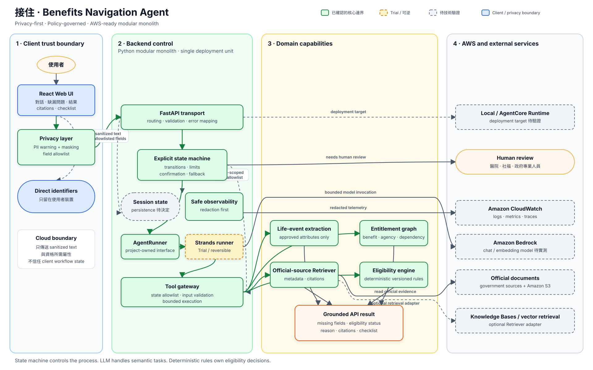
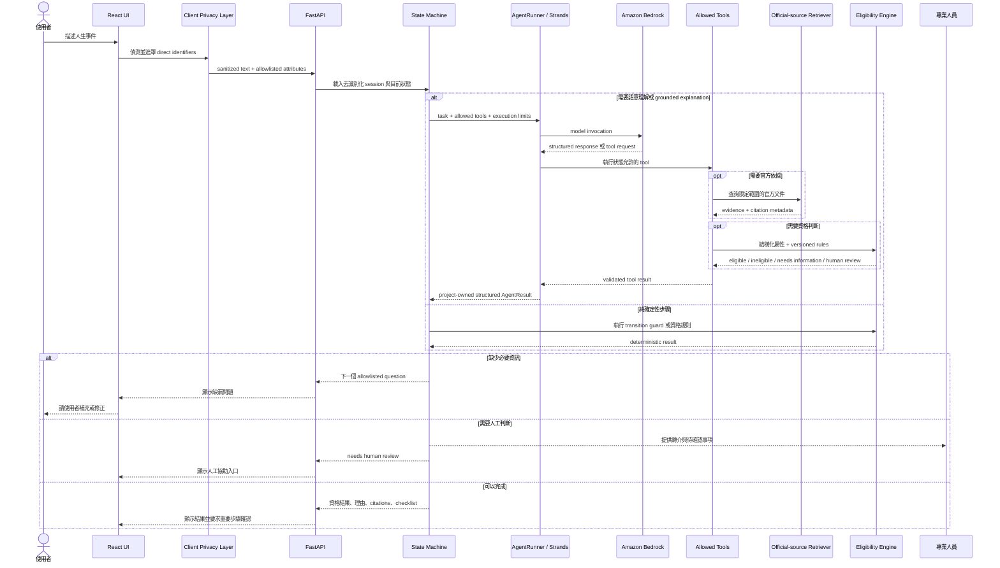

# Architecture

「接住」採用 privacy-first、policy-governed 的 modular monolith。下圖描述目前已確認的
模組責任與資料流；虛線節點代表 trial 或尚待技術驗證的選項，不是最終部署承諾。

## 系統架構圖

可直接開啟 [SVG](architecture-overview.svg) 或 [PNG](architecture-overview.png) 查看原始尺寸。

## 單次請求流程

## 控制與責任邊界

- Client 保留姓名、身分證字號、地址、電話與 email；backend 只接收 sanitized text 與
  allowlisted eligibility attributes。
- State machine 擁有狀態轉換、tool allowlist、迭代上限、錯誤處理與人工確認。
- Agent / LLM 只負責語意工作，不得自行判斷或覆寫福利資格。
- Eligibility engine 是資格狀態的唯一決策者；Retriever 只回傳可引用的官方依據。
- Strands、Bedrock model、retrieval implementation、session persistence 與 AgentCore
  deployment 都保留在自有 interface 後方，可在技術 spike 後替換。

已接受的決策與未決事項分別記錄於 [Architecture Decision Records](decisions/README.md)
與根目錄 [README](../README.md)。
