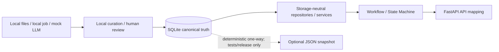

# SQLite Runtime Alignment Proposal

> **文件狀態：提案已由專案 reviewer 與 owner 共同接受。** 原預定以 ADR-0012 正式記錄，但該編號已由 state machine 決策使用；目前由 [ADR-0013: Use SQLite Runtime Behind Repositories](../decisions/0013-use-sqlite-runtime-behind-repositories.md) 正式記錄，且該 Accepted ADR 為權威來源。本文保留交接背景、歷史檢查清單與 requested response format，不取代 ADR 或 finalized spec。

## 1. 文件目的與使用方式

本文件用來對齊 backend workflow、資料層與 Rule Engine 在 SQLite runtime 上的責任、介面與遷移檢查。Accepted ADR 與 finalized requirements/design 描述目標行為；程式碼描述目前實作。兩者不一致時要回報 implementation gap，不能把文件目標當成已完成，也不能因 legacy code 存在而忽略 accepted architecture。

Yuan／Yuan's AI 的歷史交接順序仍有效：

1. 先檢查 backend 程式碼與測試，確認目前 models、dependency injection、adapters、logging 與 SQLite lifecycle。
2. 將程式碼與 Accepted ADR、finalized spec 及共同 contracts 比較。
3. 先依第 11 節格式回報一致處、衝突與影響範圍，不直接進行未核准的 code migration。
4. 依 tasks 中的 owner checkpoints 分批核准 migration、compatibility cutover、dependency 與 network work。

## 2. 接受本提案的原因

[ADR-0008](../decisions/0008-curate-in-sql-serve-from-json.md) 的成立前提是：資料只有個位數到低十位數、runtime 唯讀、已驗證資料從 SQL 匯出成 JSON，application 啟動時載入 JSON。這對固定、離線、低資料量 demo 是合理設計。

資料層現在需要支援：

- relational Entitlement Graph 與雙向關係查詢
- versioned nested Rule DSL 與人工審查狀態
- `candidate`、`under_review`、`verified`、`stale`、`rejected`、`inactive` gates
- 官方 evidence、coverage metadata 與 source refresh
- current-data-first 回應與 same-day deduplicated background work

若 runtime 仍只讀 JSON，SQL 與 JSON 會成為延遲同步的雙重真相。共同決策因此改為 SQLite curation/runtime single source of truth behind storage-neutral repositories，並由新 ADR 取代 ADR-0008。

## 3. 已接受的架構

1. **目前 local profile 的 SQLite 是 curation 與 runtime 的單一真相來源。** Runtime 只讀 last successful committed state；替換 storage 需要另立 owner-approved ADR 與 adapter migration。
2. **四個 storage-neutral ports**：`EntitlementGraphRepository`、`EligibilityService`、`EvidenceRepository`、`SourceRefreshService`。
3. **FastAPI composition root 注入**具體 implementations；workflow/state machine 不接觸 SQL、SQLite connection、rows、tuples、table/column names。
4. **Canonical rule** 是 SQLite 中 versioned nested `all_of`／`any_of` DSL。`program_rule_fields` 是 deterministic、lossless、read-only compatibility projection，不能雙寫。
5. **JSON 非 runtime input 或 fallback。** 只可由 SQLite 單向產生 optional tests/release snapshots。
6. **AWS development policy**：local SQLite、files、background job 與 mock LLM 保持預設且可測試；owner 核准後可加入 live AWS／network／LLM adapter，但不得提交 secrets，且須同步 migration guide。
7. **實作狀態**：這是 architecture/document approval，不表示 repositories、schema migration、privacy、refresh 或 runtime wiring 已完成。



## 4. Ownership boundaries

| 邊界 | 負責內容 | 明確不負責 |
| --- | --- | --- |
| Data layer | sources、graph、canonical rules、evidence、review statuses、coverage、SQLite adapters | Session 流程、API 文案、自然語言猜資格 |
| EligibilityService／Rule Engine | status gates、required fields、人工核准 DSL 的 deterministic evaluation | Crawl、LLM 判定、自動 verify |
| Workflow／state machine | Session、問題順序、停止／轉介條件、呼叫四個 ports | Ad-hoc SQL、SQLite shapes、個別方案門檻 |
| FastAPI composition root | 建立／驗證／注入 implementations 或 fakes | Route 內自行建立 adapter |
| LLM／crawler | 語言理解、分類、結構化 candidate 提取 | Eligibility、protected status transition、auto-verify |
| API／privacy／observability | Requesting User mapping、score omission、recursive sanitization | 改寫 deterministic decision |

## 5. Storage-neutral interfaces 與 shared contracts

四個 interfaces 的責任：

| Interface | Operations |
| --- | --- |
| `EntitlementGraphRepository` | event expansion、prerequisites、produces、system lookup |
| `EligibilityService` | required fields、single evaluation、batch evaluation、status gates |
| `EvidenceRepository` | item citations、evaluated source-reference citations |
| `SourceRefreshService` | coverage snapshot、non-blocking on-demand refresh receipt |

Interfaces 回傳 immutable domain contracts，不回 `sqlite3.Row`、SQL tuple 或 encoded metadata。共同 contracts 包含 `CandidateItem`、`GraphRelation`、`EligibilityDecision`、`StructuredReason`、`Citation`、`FieldRegistryEntry`、`CoverageMetadata`／`CoverageSnapshot`、`RefreshRequest`／`RefreshReceipt`。

Owner 核准的 refresh／coverage 混合契約保留 rich
`get_coverage_status(CoverageScope) -> CoverageSnapshot`，並沿用 batch
`RefreshRequest(event_id, source_ids, requested_at)` 與
`RefreshReceipt(job_id, accepted, deduplicated)`。Coverage scope 由 caller 明確提供；
service 不從 `event_id` 隱式猜 domain tags。

Yuan legacy mappings 依 [backend/data-layer handoff](README.md) 漸進處理：DB `program_id` 在 adapter 映射為 `item_id`；legacy single amount、text reasons、single source URL 不得被當成新 canonical contract，也不得由文字反推結構化值。

## 6. 已解決的 owner decisions

原第 12 節列出的 open decisions 已解決。前六項是這次 owner alignment 的主要 blocking decisions，後兩項也一併由 finalized spec 明確化：

| 原 open decision | 已接受結果 |
| --- | --- |
| 1. ADR-0008 修訂或取代 | **已解決**：ADR-0008 標為 Superseded；ADR-0013 取代它。 |
| 2. `stale` 行為 | **已解決**：可見並帶警告，但一律 `needs_human_review`，不做完整 evaluation。 |
| 3. Frontend 是否看見 `relevance_score` | **已解決**：只供 backend sorting；API/frontend 完全省略。 |
| 4. `actual` 傳輸與記錄邊界 | **已解決**：只可回給當次 Requesting User；與 raw user text 一起從 logs/traces/metrics/exceptions/audit 遞迴移除。Observability fail closed。 |
| 5. Adapter wiring | **已解決**：FastAPI application composition root 建立並注入四個 implementations；workflow/state machine 只依賴 ports/contracts。 |
| 6. JSON fallback | **已解決**：沒有 runtime JSON 或 fallback；JSON 只可單向產生供 tests/release snapshot。 |
| 7. Canonical rule representation | **已解決**：versioned nested Rule DSL 是唯一真相；`program_rule_fields` 是 deterministic/lossless/read-only projection。 |
| 8. Coverage 說法 | **已解決**：只回報 measurable status、counts 與 gaps；不得宣稱零遺漏或完整保證。 |
| 9. Refresh／coverage API shape | **已解決**：rich scope/snapshot coverage 搭配 batch event/source refresh request，receipt 保留 `accepted` 與 `deduplicated`。 |

另外確認：所有 SQLite connections 必須有 `contextlib.closing` 或等價 close guarantee；crawler／LLM 永不 auto-verify。Owner 核准後可使用 live network／AWS／LLM 驗證，但 credentials 不得進 Git、local tests 必須保留，且本決策仍未選 production AWS service。

## 7. Status、privacy、refresh 與 coverage gates

| `program_status` | Runtime 行為 |
| --- | --- |
| `verified` | 規則與 citations 完整時做 deterministic evaluation；缺漏時降級 `needs_human_review`。 |
| `candidate`／`under_review` | 可見並警告尚未二次確認；不做完整 evaluation，回 `needs_human_review`。 |
| `stale` | 可見並警告；永遠 `needs_human_review`。 |
| `rejected`／`inactive` | 隱藏且 non-evaluable。 |

`relevance_score` 不得離開 backend。`StructuredReason.actual` 可回 Requesting User，但不得進任何 observability 或 audit。Raw user text 只存在 request-local extraction scope；sanitizer 無法確認安全時不得 serialize/emission 原 payload。

Refresh 先用 request-start committed SQLite 回應，再 enqueue local background job。Dedup key 等價於 source＋event/topic＋application-timezone date；同日同 key 只建立一個 job。Worker failure 不修改原 response 或 last committed state。Crawler／LLM outputs 只能是 candidate／under_review。

Coverage 只記錄 scope、observed time、source statuses、indexed counts 與 gap categories；robots、login、JavaScript-only、broken links、scanned attachments 或 connection failures 都是 gaps，而不是「零遺漏」。

## 8. 歷史 backend 檢查清單（保留，尚不代表完成）

Yuan's AI 在 code migration 前應檢查並回報：

- [ ] `CandidateItem`、legacy `EligibilityResult`、內外部 `Citation`、field/question models 的目前欄位與責任。
- [ ] Graph、eligibility、evidence、refresh dependencies 的現有注入點與 FastAPI composition-root cutover。
- [ ] `program_id` ↔ `item_id` 映射、unknown ID 行為與 compatibility tests。
- [ ] Legacy amount／amount label 與 amount quartet 的差異；確認不從文字推定。
- [ ] Text reasons 到 `StructuredReason` 的契約遷移，以及所有 `actual` logging paths。
- [ ] Single `source_url` 到完整 `Citation` 的 mapping 與 missing evidence downgrade。
- [ ] 六種 ProgramStatus 的 query、sorting、visibility 與 evaluation gates。
- [ ] 所有 SQLite connections 在 success、exception、rollback 與 teardown 確實關閉。
- [ ] Workflow、state machine、API mapping 是否含 SQL、SQLite row 或 table/column dependency。
- [ ] 四個 ports 是否有 no-SQL fakes，且 fake startup 不開 DB。
- [ ] Runtime import/startup/request path 是否完全不讀 JSON snapshot 或 fallback。
- [ ] 受影響 unit、integration、contract、architecture、privacy 與 migration tests。

## 9. 歷史 data-layer 檢查清單（保留，尚不代表完成）

Data layer owner 應確認：

- [ ] Graph nodes/edges、conditions、foreign keys、stable ordering 與 indexes。
- [ ] Field registry canonical IDs、types、allowed values、prompts、reasons 與 PII classification。
- [ ] Canonical Rule DSL version/tree validation、operator allowlist 與 source references。
- [ ] `program_rule_fields` deterministic/lossless projection、reverse conversion、read-only enforcement 與 atomic generation。
- [ ] Structured reasons 提供 condition、field、operator、expected、actual、label、source reference。
- [ ] Citation 可 exact-map registered/approved documents 與 excerpts。
- [ ] ProgramStatus gates、review history 與 human-only protected transitions。
- [ ] Graph、eligibility、evidence、coverage／refresh SQLite repositories。
- [ ] Current-data-first local job、timezone-aware same-day dedup 與 coverage invariants。
- [ ] Optional JSON exporter 只從 SQLite 單向產生，具版本、stable order 與 atomic replace。
- [ ] Migration backup、legacy preservation、dry run、rollback 與 compatibility window。

## 10. 仍待 owner 核准的 implementation sequencing

架構決策已完成，但下列實作順序仍須依 tasks checkpoints 核准：

1. Ordered migrations、backup marker、temporary-copy dry run 與 rollback batch。
2. Legacy rule preservation、人工核對與 canonical approval 批次。
3. Compatibility projection cutover 與 legacy consumer inventory。
4. Runtime reader 切換到四個 ports／EligibilityService 的時點。
5. Optional property-test dependency 與 optional JSON exporter 的導入時點。
6. 8 月 1 日後是否需要 production storage/network adapter；任何 AWS service 選擇都需另立 ADR。

Rollback 只回到上一個受支援 schema、完整 projection generation 與 last successful committed SQLite state；不得回退成 JSON runtime。

## 11. Yuan's AI requested response format（保留）

任何 code edit 前的交接回覆至少包含：

```markdown
## 已對齊項目
- ...

## 衝突
- 現況：...
- 預期：...
- 影響：...

## 受影響的 Backend 檔案
- `path/to/file.py`：原因

## 契約變更
- 舊形狀：...
- 提議形狀：...
- 相容性影響：...

## 遷移／相容性計畫
- 步驟、fallback、rollback 或 adapter 策略

## 測試
- 應新增或修改的 unit、integration、contract、privacy tests
- 預計執行的精確命令

## 需要 Owner 決策
- 決策項、選項與影響

## 編輯狀態
- 尚未修改任何程式碼，等待 owner 核准
```

這個格式的價值在於：把「legacy 現況」、「accepted 目標」與「尚待 owner 決定的 cutover sequencing」分開，避免 contributor 靜默改變 schema、API、privacy 或 runtime truth。

## 12. Non-goals

本 alignment 不包含：

- 未經 owner 決策就選定 production AWS database、queue、object storage、deployment 或 observability service
- 提交 AWS／network／LLM credentials、tokens、`.env` 或 account-specific secrets，或讓 local tests 依賴 live services
- 讓 LLM、crawler、importer、converter 或 exporter 決定 eligibility 或 auto-verify
- 新增、推定或解釋任何福利門檻、期限、金額、法規原文或來源摘錄
- 把 coverage 描述成法律／網站完整、零遺漏或所有福利均已索引

正式 requirements 與 detailed design：

- [Requirements](../../.kiro/specs/data-layer-rule-engine/requirements.md)
- [Design](../../.kiro/specs/data-layer-rule-engine/design.md)
