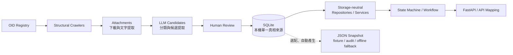

# SQLite Runtime Alignment Proposal

> **文件狀態：跨團隊交接提案，非規格階段文件，也不是最終 ADR。** 目標讀者為 Yuan Lin 與 Yuan's AI。本文件不自行修改或取代任何既有決策；涉及架構、契約或資料模型的變更，必須先由相關 owner 共同核准。

## 1. 文件目的與使用方式

本文件用來對齊後端 workflow、資料層與規則引擎在 SQLite runtime 上的責任、介面與資料形狀，讓雙方在改程式前先找出衝突。

Yuan／Yuan's AI 必須依以下順序進行：

1. 先檢查目前 backend 程式碼與測試，確認實際存在的 models、dependency injection、adapter、logging 與 SQLite 使用方式。
2. 將程式碼與本文件、已核准 contracts、ADR 及資料層規格逐項比較。
3. 先依第 13 節格式回報一致處、衝突與影響範圍，**不得直接編輯程式碼**。
4. 等 owner 核准契約、遷移方式與待決策項目後，才提出或執行實作計畫。

判讀原則：

- **程式碼描述目前實作。** 文件若聲稱某功能已存在，但程式碼沒有，應以程式碼為準並回報落差。
- **已核准的 contracts 與 ADR 描述預期行為。** 程式碼若違反已核准治理要求，不能因「目前就是這樣」而視為正確。
- 本文件只是提案，不得凌駕 accepted ADR，也不得被當成已核准的實作指令。

## 2. 為什麼需要對齊

ADR-0008 的成立前提是：MVP 資料只有個位數到十幾筆、runtime 唯讀、已驗證資料由 SQL 匯出成 JSON，application 啟動時將 JSON 載入記憶體，runtime 不查 SQL。這個做法適合小型、固定、需要離線存活的初版 demo。

新的資料層範圍已擴大，包含：

- 關聯式 Entitlement Graph nodes／edges 與雙向遍歷；
- 依需求觸發的結構性爬取；
- `candidate`／`under_review` 方案的受控可見性；
- 官方來源更新、coverage metadata 與 `stale` 狀態；
- PDF、Word 等附件下載與文字提取；
- LLM 候選提取與人工審查；
- 明顯可能超出低十位數的資料量。

因此，ADR-0008 的「runtime 只讀 JSON、永不查 SQL」與新規格的動態圖查詢、來源刷新、審查狀態及較大資料集互相衝突。**修訂或取代 ADR-0008 前，必須由後端與資料層 owner 共同核准。** 在正式決策完成前，ADR-0008 仍是現行 accepted ADR，本提案不能自行宣告它失效。

## 3. 提議決策

1. **2026 年 8 月 1 日前，以 SQLite 作為 curation 與 runtime 的本機單一資料真相來源。** 來源、graph、規則、證據與審查狀態都以 SQLite 為準。
2. Runtime 只透過 **storage-neutral repository／service interfaces** 取用資料；workflow 與 state machine 不得出現臨時 SQL，也不得依賴 SQLite connection、row 或資料表欄名。
3. JSON 為選配且由 SQLite **自動產生**，用途只限 snapshot、測試 fixture、audit diff 或離線 fallback。JSON 不得成為人工維護的重複真相，也不是 runtime 的必要輸入。
4. **8 月 1 日前不得連線或建立 live AWS 資源。** 先使用本機 SQLite 與本機背景工作替代方案。
5. 未來若採用其他儲存服務，新的 storage adapter 必須維持相同 interfaces，避免 workflow 因儲存技術改變而重寫。
6. 本節仍是待核准提案。核准後應另行修訂／取代 ADR-0008，而不是把本文件當作最終 ADR。

## 4. Mermaid 目標架構



資料流的核心限制是：crawler 與 LLM 只能建立候選資料，人工審查後的 SQLite 狀態才可控制 runtime 行為；workflow 只看 domain contracts，不看資料表。

## 5. Ownership boundaries

| 邊界 | 負責內容 | 明確不負責 |
| --- | --- | --- |
| Data layer | 官方來源、graph、規則資料、證據、審查狀態、coverage metadata、repository adapters | Session 流程、API 呈現、以自然語言猜資格 |
| Rule Engine | 根據已核准的宣告式規則進行確定性 eligibility 判斷 | 爬網、LLM 判定、自行修改 workflow 狀態 |
| Workflow | Session、state、問題順序、停止／轉介條件、repository 注入、API mapping | 臨時 SQL、硬編碼個別福利門檻、重做 eligibility 判斷 |
| LLM | 語言理解、白話解釋、頁面分類、結構化**候選**提取 | eligibility 判斷、自動驗證、自動覆寫 verified 規則 |

資格結論必須由 deterministic Rule Engine 產生。LLM 不得決定或覆寫 `eligible`、`ineligible`、`needs_information`、`needs_human_review`。

## 6. Storage-neutral interface contracts

以下是提議的 Python contracts，用來討論跨層形狀；它們不是已核准程式碼。實際 module path、同步／非同步方式與 dependency injection 位置，需由 Yuan's AI 檢查現況後回報。

```python
from collections.abc import Mapping, Sequence
from dataclasses import dataclass
from datetime import datetime
from typing import Any, Protocol

UserAttributes = Mapping[str, Any]


class EntitlementGraphRepository(Protocol):
    def expand_from_event(
        self,
        event_id: str,
        user_attributes: UserAttributes,
    ) -> Sequence["CandidateItem"]: ...

    def get_prerequisites(self, item_id: str) -> Sequence["GraphRelation"]: ...

    def get_produces(self, item_id: str) -> Sequence["GraphRelation"]: ...

    def get_programs_by_system(self, system_id: str) -> Sequence["CandidateItem"]: ...


class EligibilityService(Protocol):
    def get_required_fields(
        self,
        item_id: str,
    ) -> Sequence["FieldRegistryEntry"]: ...

    def evaluate(
        self,
        item_id: str,
        user_attributes: UserAttributes,
    ) -> "EligibilityDecision": ...

    def evaluate_many(
        self,
        item_ids: Sequence[str],
        user_attributes: UserAttributes,
    ) -> Sequence["EligibilityDecision"]: ...


class EvidenceRepository(Protocol):
    def get_citations(self, item_id: str) -> Sequence["Citation"]: ...


@dataclass(frozen=True)
class RefreshRequest:
    event_id: str
    source_ids: tuple[str, ...]
    requested_at: datetime


@dataclass(frozen=True)
class RefreshReceipt:
    job_id: str
    accepted: bool
    deduplicated: bool


class SourceRefreshService(Protocol):
    def get_coverage_status(
        self,
        event_id: str,
    ) -> Sequence["CoverageMetadata"]: ...

    def request_on_demand_refresh(
        self,
        request: RefreshRequest,
    ) -> RefreshReceipt: ...
```

介面約束：

- `SourceRefreshService` 必須先回傳目前 coverage 狀態，再以非阻塞方式排入 on-demand refresh；使用者請求不得等待 crawl 或 LLM 完成。
- `EligibilityService` 可在內部呼叫 rule repository 與 deterministic Rule Engine，但 workflow 不應知道規則存在哪張表。
- SQLite adapter、未來 storage adapter 與測試 double 都要實作同一組 contracts。
- Repository 回傳 domain dataclass，不回傳 `sqlite3.Row`、SQL tuple 或未解碼的 `metadata_json`。

## 7. Shared data contracts

以下 dataclasses 表示跨層交換資料，不等同 SQLite schema。欄位命名差異由 adapter 處理。

```python
from dataclasses import dataclass
from datetime import datetime
from typing import Any, Literal

ProgramStatus = Literal[
    "candidate",
    "under_review",
    "verified",
    "stale",
    "rejected",
    "inactive",
]
EligibilityStatus = Literal[
    "eligible",
    "ineligible",
    "needs_information",
    "needs_human_review",
]
AmountPeriod = Literal["one_time", "monthly", "annual"]


@dataclass(frozen=True)
class GraphRelation:
    item_id: str
    display_name: str
    order: int = 0


@dataclass(frozen=True)
class CandidateItem:
    item_id: str
    display_name: str
    program_status: ProgramStatus
    relevance_score: int | float | None
    missing_field_ids: tuple[str, ...]
    prerequisites: tuple[GraphRelation, ...]
    produces: tuple[GraphRelation, ...]


@dataclass(frozen=True)
class StructuredReason:
    condition_id: str
    field_id: str
    operator: str
    expected: Any
    actual: Any
    label: str
    source_reference: str


@dataclass(frozen=True)
class EligibilityDecision:
    item_id: str
    status: EligibilityStatus
    amount_min: int | None
    amount_max: int | None
    amount_period: AmountPeriod | None
    amount_currency: str | None
    reasons: tuple[StructuredReason, ...]


@dataclass(frozen=True)
class Citation:
    document_id: str
    title: str
    publisher: str
    published_at: str | None
    effective_at: str | None
    url: str
    excerpt: str
    retrieved_at: str | None


@dataclass(frozen=True)
class FieldRegistryEntry:
    field_id: str
    data_type: str
    allowed_values: tuple[str, ...]
    prompt_label: str
    why_needed: str
    pii_classification: str


@dataclass(frozen=True)
class CoverageMetadata:
    source_id: str
    crawl_status: str
    last_crawled_at: datetime | None
    indexed_document_count: int
    domain_tags: tuple[str, ...]
```

契約規則：

- `CandidateItem` 必須提供 `item_id`、`display_name`、`program_status`、`relevance_score`、`missing_field_ids`、`prerequisites`、`produces`。
- `EligibilityDecision` 必須提供 `item_id`、`status`、金額上下限、發放週期、幣別及結構化原因；不得只提供展示文字。
- `StructuredReason.actual` 可以回傳給提出該請求的使用者，用來解釋「你的情況」與「規則要求」的差異；**actual 值永遠不得寫入 log、trace、metric、exception message 或持久化 audit event。**
- Citation 必須保留文件識別、標題、發布者、發布／生效時間、URL、引用段落與擷取時間，不得退化成單一 `source_url`。
- Field registry 是 workflow 提問的共同詞彙表，包含型別、合法值、提問文字、為何需要及 PII 分類。
- Coverage metadata 表示可量測的來源進度，不代表法律或網站內容的絕對完整性。
- SQLite 的 `program_id` 到 workflow 的 `item_id` 映射屬於 adapter；workflow 不應為資料表欄名改變 domain contract。
- `relevance_score` 只代表相關性，不代表符合資格的機率或程度。

## 8. Status 與 safety gates

| `program_status` | Runtime 行為 |
| --- | --- |
| `verified` | 執行完整 deterministic evaluation，並附已核准的規則版本與 citations。 |
| `candidate`／`under_review` | 可以顯示，但必須標示「**尚未二次確認**」；不得執行完整資格判斷，只能回 `needs_human_review`。 |
| `stale` | 尚待共同決策：方案 A 使用 last-verified snapshot 並顯示明確警告；方案 B 直接回 `needs_human_review`。未決策前不得自行選擇。 |
| `rejected`／`inactive` | 隱藏，不進入候選結果或資格評估。 |

共同安全閘門：

- 永遠不得記錄 raw user text。
- 永遠不得記錄實際 eligibility values，包括 `StructuredReason.actual`。
- Log 只可包含不含使用者值的 ID、狀態、數量、時間與錯誤類型。
- Crawler／LLM 輸出只能進入候選或待審查狀態。
- 無已核准條件與證據時，不得產生完整 eligibility 結論或虛構原因。

## 9. On-demand refresh

每次使用者請求的建議流程：

1. 先使用目前本機 SQLite 資料立即回應；不得等待新的 crawl、附件處理或 LLM 分析。
2. 查詢與事件 `domain_tags` 相關且已核准可抓取來源的 coverage metadata。
3. 若來源為 `pending_crawl` 或依 `check_frequency` 已到期，排入本機背景 refresh job。
4. 以 `source_id + event_id/topic + 日期` 或等價鍵進行 same-day dedup；同一來源同一天不得因多個請求重複觸發。
5. Refresh 失敗不應阻塞或撤銷目前資料的回應；錯誤記錄不得包含使用者文字或 eligibility values。
6. Crawl 或 LLM 產出不得自動標為 `verified`，也不得靜默修改任何 verified rule。狀態提升與規則變更必須經人工審查。

這個流程是「先用已知資料回答，再更新候選資料」，不是「等網路爬完才回答」。

## 10. Yuan's AI 的精確 backend 檢查清單

Yuan's AI 必須先檢查並回報以下項目；未獲 owner 核准前不得改 code：

- [ ] `CandidateItem`、`EligibilityResult`、內部與對外 `Citation`、field／question models 的目前欄位、列舉與責任。
- [ ] Graph、eligibility、evidence、refresh dependencies 的現有注入點，以及 state machine／API handler 應如何取得 interfaces。
- [ ] `program_id` ↔ `item_id` 映射位置、未知 ID 行為及相容性測試。
- [ ] 單一 `amount`／`amount_label` 與 `amount_min`、`amount_max`、`amount_period`、`amount_currency` 的差異；確認週期不能由文字或 frontend 猜測。
- [ ] 文字 `reasons` 到 `StructuredReason` 的契約變更，以及 logging 是否可能洩漏 `actual`。
- [ ] 單一 `source_url` 到完整 `Citation` 的 mapping 與缺欄位行為。
- [ ] `verified`、`candidate`、`under_review`、`stale`、`rejected`、`inactive` 的實際查詢、排序、顯示與 eligibility 行為。
- [ ] 所有 SQLite connection 是否在成功、例外與測試 teardown 路徑確實關閉；不可只依賴 `with sqlite3.connect(...)` 提交交易。
- [ ] Workflow、state machine、API mapping 是否含 ad-hoc SQL、`sqlite3.Row` 或資料表欄名依賴。
- [ ] 每個 interface 是否有不需 SQLite 的 test double／fake，讓 workflow 測試可獨立執行。
- [ ] 受影響的 unit、integration、contract 與 privacy logging tests，以及目前測試命令是否可執行。

## 11. Data-layer 檢查清單

資料層 owner 應確認：

- [ ] Graph schema、外鍵、condition JSON、雙向查詢、穩定排序與必要 indexes。
- [ ] Field registry 的 canonical `field_id`、型別、合法值、提問文案、必要原因與 PII 分類。
- [ ] `amount_period` 的 canonical 值與每個給付資料的來源，不從金額文字推測。
- [ ] Structured reasons 能提供 condition、field、operator、expected、actual、label 與 source reference。
- [ ] Citations 能從 `source_documents`／`program_sources` 組出完整共同契約。
- [ ] 各 `program_status` 的查詢 gates、排序及 verified-only evaluation 規則。
- [ ] Graph、status、source、rule fields 與 citation joins 的必要 indexes。
- [ ] Graph、eligibility、evidence、coverage／refresh 的 SQLite repositories。
- [ ] 選配 JSON exporter 只從 SQLite 自動產生，輸出具版本與 deterministic ordering，且不接受手動回寫為第二份真相。

## 12. 已知衝突與待決策

以下項目尚未定案，任何一方都不得靜默選擇：

1. **ADR-0008 修訂或取代：** SQLite runtime 提案與「runtime 只讀 JSON」直接衝突，需共同核准並留下正式 ADR。
2. **`stale` 行為：** 使用 last-verified snapshot 加警告，或一律降級為 `needs_human_review`。
3. **Frontend 是否看見 `relevance_score`：** 顯示分數可能被誤讀為資格程度；只排序則較難解釋排序理由。
4. **`actual` 的傳輸與記錄邊界：** 可回給提出請求的使用者，但不得進 log；需確認 response schema、error handling 與 observability filter。
5. **Adapter wiring：** repository／service 在 application、state machine 或 tool layer 的實際注入位置。
6. **是否需要 JSON fallback：** 若需要，必須定義產生時機、版本、完整性檢查與 fallback 啟用條件；若不需要，不應為假想需求增加維護成本。
7. **規則 canonical representation：** 現有 `program_rule_fields` 與 `docs/data-model.md` 的巢狀 `all_of`／`any_of` DSL 不是同一形狀。必須選擇唯一 canonical representation，或提供可測試、deterministic、無資訊損失的 converter；不可讓兩者各自演進。
8. **Coverage 說法：** 絕對不遺漏的保證無法成立，因為 robots.txt、JavaScript-only 頁面、登入限制、失效連結、掃描附件或暫時不可存取網站都可能造成缺口。應回報可量測的 coverage status，例如已登記來源數、已爬取來源數、錯誤數、最後爬取時間與已索引文件數，不得宣稱「零遺漏」。

## 13. Yuan's AI 必須使用的回覆格式

Yuan's AI 在任何 code edit 前，必須交付一份回覆，且至少包含以下小節：

```markdown
## 已對齊項目
- ...

## 衝突
- 現況：...
- 預期：...
- 影響：...

## 受影響的 Backend 檔案
- `path/to/file.py`：原因

## 契約變更
- 舊形狀：...
- 提議形狀：...
- 相容性影響：...

## 遷移／相容性計畫
- 步驟、fallback、rollback 或 adapter 策略

## 測試
- 應新增或修改的 unit、integration、contract、privacy tests
- 預計執行的精確命令

## 需要 Owner 決策
- 決策項、選項與影響

## 編輯狀態
- 尚未修改任何程式碼，等待 owner 核准
```

若檢查發現本提案的假設與程式碼不同，必須列為衝突，不可為了符合本文件而直接改 code。

## 14. Non-goals

本提案不包含：

- 選定 production AWS database、部署服務或最終雲端架構；
- 8 月 1 日前的任何 live AWS call 或資源建立；
- 讓 LLM 判斷 eligibility；
- 讓 crawler、LLM 或匯入腳本自動驗證資料；
- 在 MVP 階段完整爬取約 8,000 個政府機關；
- 在本文件中新增、推定或解釋任何法律資格規則。

本提案只處理跨層 runtime alignment。福利門檻、期限、金額與適用條件仍必須來自經人工確認的官方來源，不得由本文件或 AI 補寫。